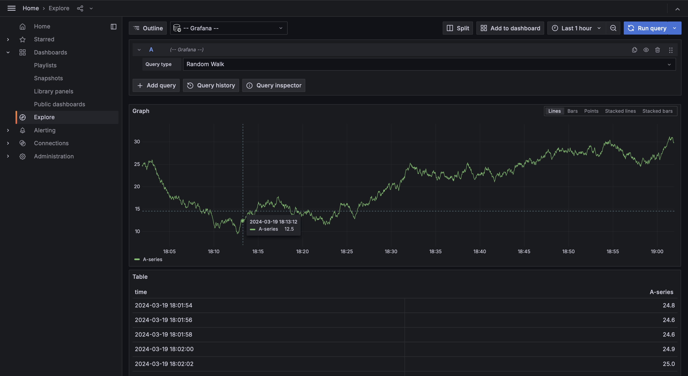
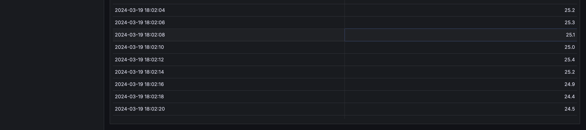

# Logging Stack Report

In this document, I will provide a detailed overview of the logging stack that has been set up, including its components and their respective roles.

## Components

### 1. Grafana

**Role**: Grafana is an open-source analytics and monitoring platform that allows you to query, visualize, alert on, and understand your metrics no matter where they are stored. In the logging stack, Grafana serves as the dashboarding tool where logs and metrics can be visualized.

### 2. Loki

**Role**: Loki is a horizontally scalable, highly available, multi-tenant log aggregation system inspired by Prometheus. It is designed to be very cost-effective and easy to operate. Loki allows you to query logs using the same labels that you're already using with Prometheus, enabling easy integration with Grafana for visualization.

### 3. Promtail

**Role**: Promtail is an agent that ships the contents of local logs to a private Loki instance or Grafana Cloud. It is usually deployed to every machine that has applications needed to be logged. Promtail is responsible for tailing log files, extracting and parsing log lines, and sending them to Loki.

## Functioning

The logging stack functions as follows:

1. **Promtail Configuration**: Promtail is configured to tail log files from specific directories on each host. It extracts labels from log entries and sends them to Loki for storage and indexing.

2. **Loki Configuration**: Loki receives log entries from Promtail and stores them. It indexes the logs based on the labels extracted by Promtail, making it efficient to query logs based on various dimensions.

3. **Grafana Configuration**: Grafana is configured to query data from Loki and visualize log data using dashboards. It allows users to create custom dashboards and panels to monitor log data in real-time.

## Conclusion

The logging stack consisting of Grafana, Loki, and Promtail provides a robust solution for log aggregation, storage, and visualization. Grafana serves as the frontend dashboarding tool, while Loki stores logs efficiently and allows for querying based on labels. Promtail ensures that log data is collected from various sources and sent to Loki for storage. This setup enables effective monitoring and troubleshooting of applications and systems.

## Screenshots

