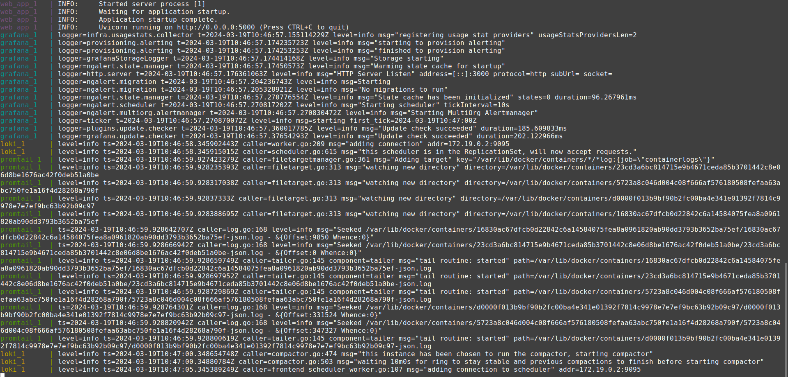
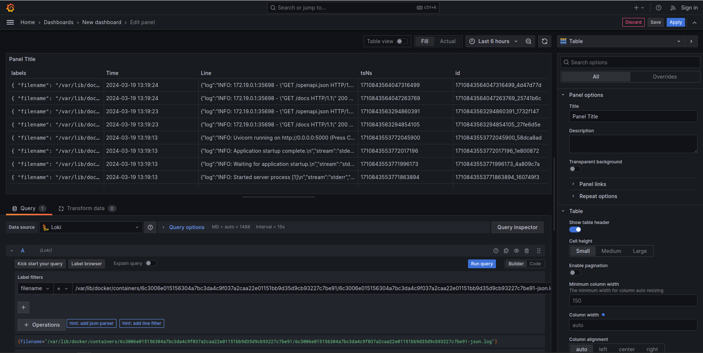
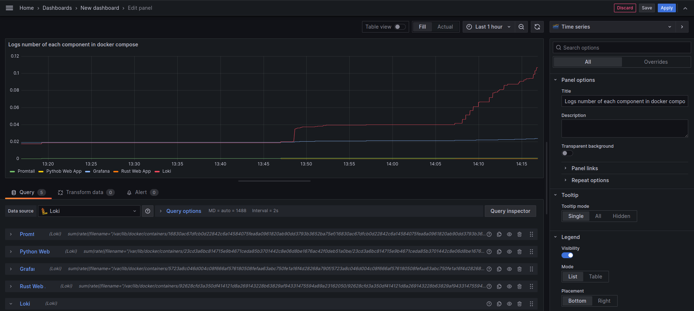

# Logging

---

## Logging Stack Setup

To setup logging stack I created docker-compose file
with some configuration files

---

## Docker Compose File

### Network

Created one network (`loki`) to include
all logging stack that communicate with each other

### Services

#### Python Web Application

Web application for getting time

- Pulling image from docker hub
- Exposing port inside container to some port in the host machine

#### Rust Web Application

Web application to perform basic math operations.

- Pulling image from docker hub
- Exposing ports

#### Loki

Database.
It provides efficient way of storing
and quering logs

- Pulling image
- Exposing port
- Show location of config file
- Connect to logging network

#### Promtail

Getting logs from the sources.
Currently it reads logs from all docker containers
on the host machine

- Pulling image
- Mount necessary files/directories for work (config file and dir with docker logs)
- Exposing port
- Show location of config file (inside container)
- Connect to the logging network

#### Grafana

Visualization of data.
Currently it has loki as a default
data source provider.

- Pulling image
- Put necessary env variables
- Write loki service as default in the container
- Expose ports
- Connect to the logging network

## Promtail Config

It specifies how to find data
and where to send/put it

Promtail has builtin
docker logs parser.
So, it is sufficient to put path to docker logs

---

## Screenshots

### Docker Logs

### Logs from web app using Loki in Grafana

### All Services In Docker Compose File

