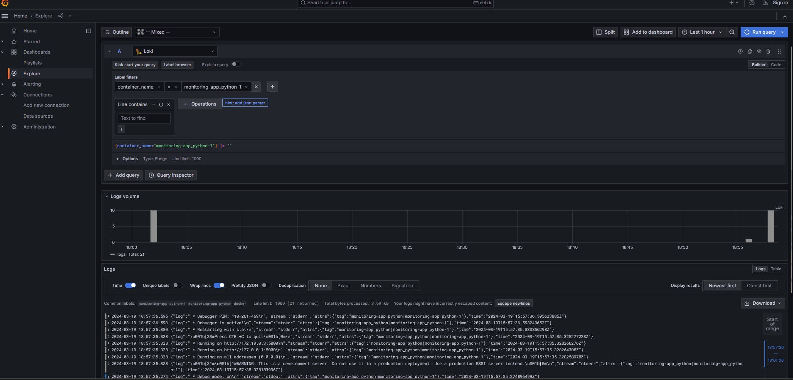
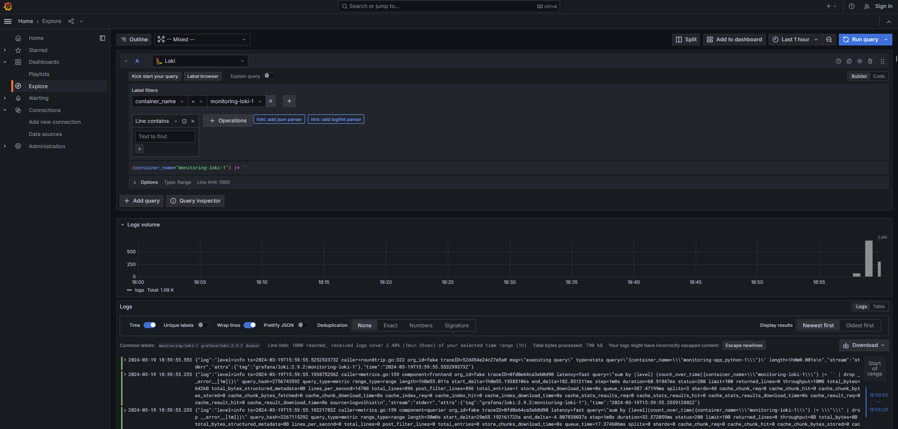
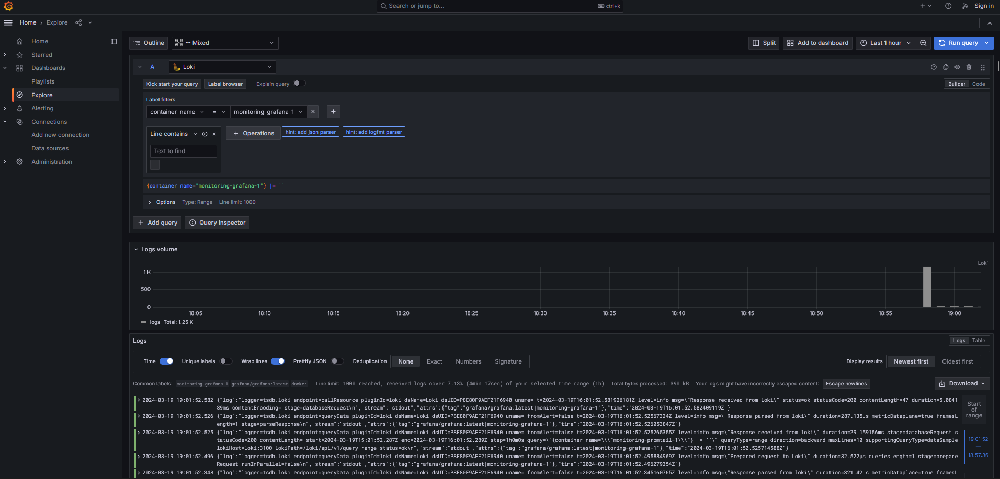

# Logging Configuration

## Overview

This logging configuration integrates Docker containers with Grafana Loki, Grafana, and Promtail to collect, store, and display logs. Promtail retrieves logs from Docker containers, Loki stores them, and Grafana visualizes them.

## File Structure

- `docker-compose.yaml`: Configuration file defining services for Flask and Go applications, Grafana, Loki, and Promtail.
- `promtail.yaml`: Configuration file specifying log scraping targets and pipeline stages.

## Services

### Flask Application Service (`app_python`)

- **Build**: ../app_python
- **Ports**: 8080:5000
- **Logging Configuration**: Utilizes the JSON file logging driver with default settings.

### Loki Service (`loki`)

- **Image**: grafana/loki:2.9.3
- **Ports**: 3101:3100
- **Configuration**: Utilizes a local configuration file mounted within the container `local-config.yaml`.

### Promtail Service (`promtail`)

- **Image**: grafana/promtail:2.9.3
- **Volumes**: Mounts the host's `/var/lib/docker/containers` directory to collect logs.
- **Configuration**: Uses a local configuration file mounted inside the container `config.yml`.

### Grafana Service (`grafana`)

- **Image**: grafana/grafana:latest
- **Ports**: 3000:3000
- **Environment Variables**: Configures Grafana with datasource provisioning.
- **Configuration**: Upon startup, automatically configures the Loki datasource `ds.yaml`.

## Logging Mechanism

- **Promtail**: Scrapes log files to collect logs from Docker containers.
- **Loki**: Stores the collected logs and provides a query interface.
- **Grafana**: Visualizes logs stored in Loki using dashboards and panels.

## Accessing Logs

1. **Grafana**: Access Grafana at `http://localhost:3000` (or `http://127.0.0.1:3000`) to visualize logs.
2. **Explore Feature**: Utilize Grafana's Explore feature to query and explore logs stored in Loki.