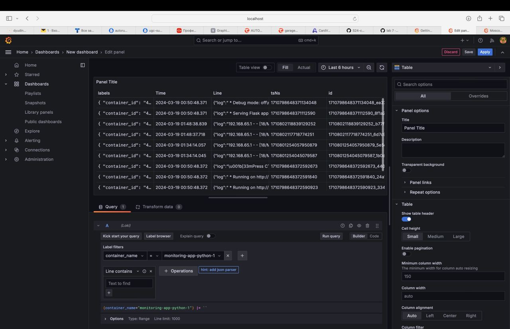
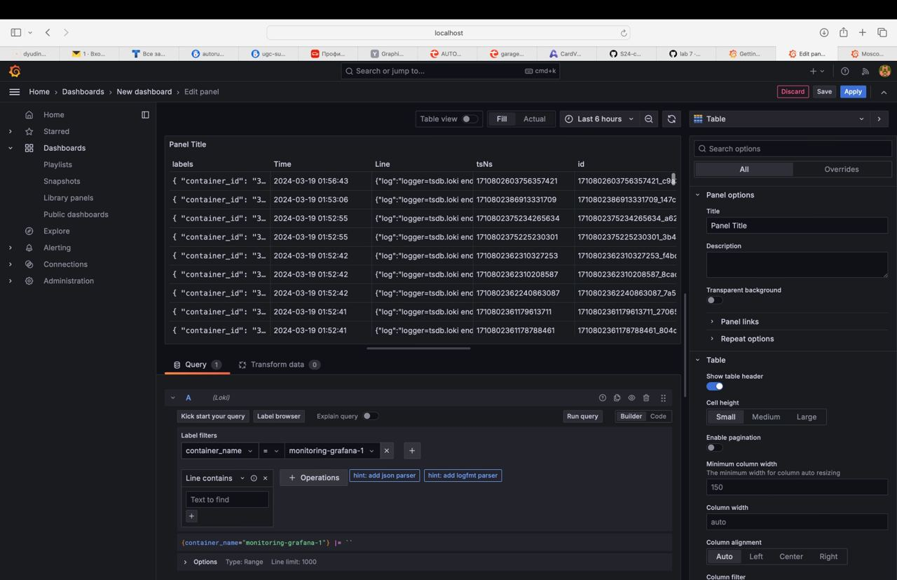
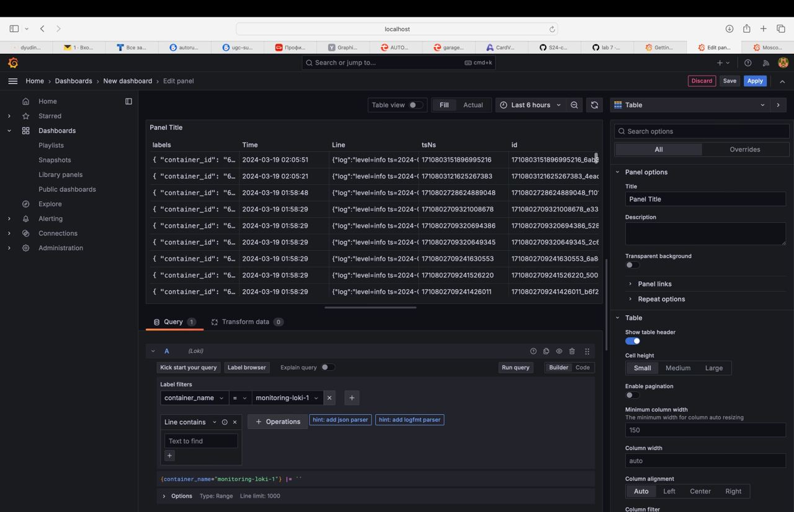
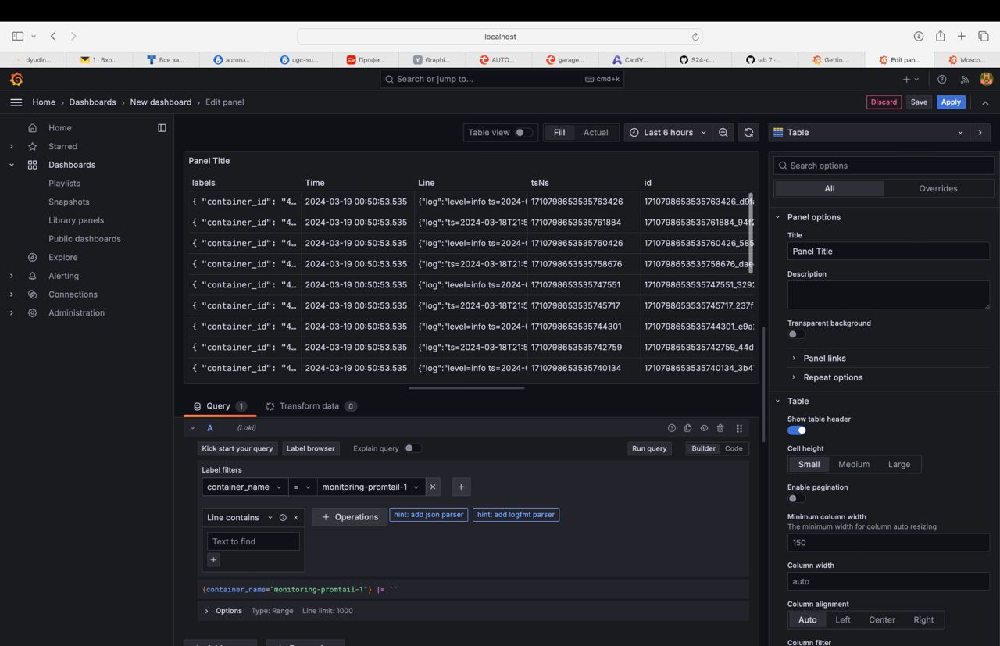

## Logging Stack Report

This document offers insights into the logging stack configuration outlined in the `docker-compose.yml` file.

### Overview of docker-compose.yml

#### app-python

- **Objective:** Represents the Python application.
- **Logging Mechanism:** Utilizes the `json-file` logging mechanism.
- **Customization:** Marks log messages with `{{.ImageName}}|{{.Name}}`.

#### loki

- **Objective:** Log aggregation service.
- **Image:** grafana/loki:2.9.2.
- **Ports:** Port 3100 is exposed.
- **Setup:** Operates with a local configuration file `/etc/loki/local-config.yaml`.

#### promtail

- **Objective:** Log collection agent.
- **Image:** grafana/promtail:2.9.2.
- **Volumes:** Mounts `./promtail.yml:/etc/promtail/config.yml` and `/var/lib/docker/containers:/var/lib/docker/containers`.
- **Setup:** Utilizes a local configuration file `/etc/promtail/config.yml`.

#### grafana

- **Objective:** Visualization tool for logs.
- **Environment Variables:** 
  - `GF_PATHS_PROVISIONING=/etc/grafana/provisioning`
  - `GF_AUTH_ANONYMOUS_ENABLED=true`
  - `GF_AUTH_ANONYMOUS_ORG_ROLE=Admin`
- **Configuration:** Sets up a datasource for Loki in `/etc/grafana/provisioning/datasources/ds.yaml`.
- **Image:** grafana/grafana:latest.
- **Ports:** Port 3000 is exposed.

### Overview of promtail.yml

This configuration file enables Promtail to gather and process logs from Docker containers and forward them to Loki for storage and analysis.

#### Server Configuration
Defines the ports for Prometheus server listening, with `http_listen_port` configured as `9080` for HTTP requests.

#### Positions Configuration
Specifies the path to the positions file used by Prometheus server to monitor the last scrape position for each target.

#### Clients Configuration
Specifies the URL where Prometheus should send metrics, in this instance `http://loki:3100/loki/api/v1/push`, indicating Loki as the destination.

#### Scrape Configurations
- `job_name`: Identifies the job name for scraping metrics, set as `docker`.
- `static_configs`: Specifies the targets to scrape, with only `localhost` targeted here.
- `labels`: Adds extra labels to the scraped metrics.
- `__path__`: Sets the path pattern for matching log files to scrape, aiming at log files in Docker container directories.
- `pipeline_stages`: Defines a sequence of processing stages for scraped log lines, including JSON parsing, extraction of specific fields using regular expressions, timestamp conversion, label addition, and specification of the final output format.

## Screenshots

