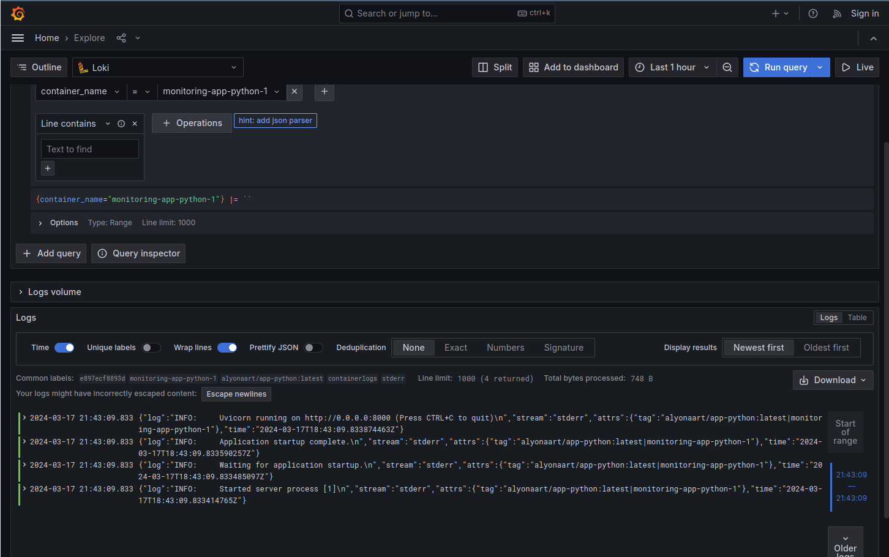
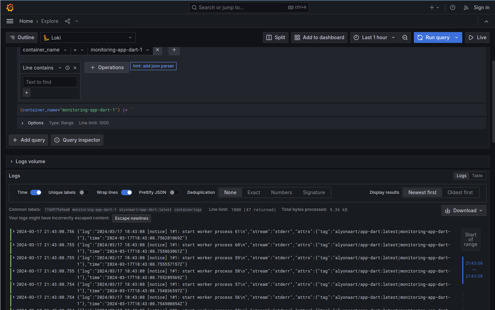

# Logging

A Loki-based logging stack consists of 3 components:

- **Promtail** is the agent, responsible for gathering logs and sending them to Loki.
- **Loki** is the main server, responsible for storing logs and processing queries.
- **Grafana** for querying and displaying the logs.

## Screenshots

### App Python

### App Dart

### Graphana

### Loki

### Promtail

