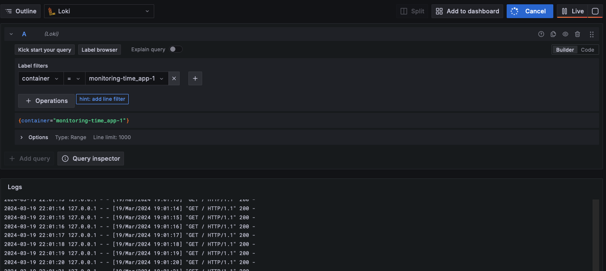

# Logging

## Overview

This logging stack collects, aggregates and displays logs from docker containers.

## Components

* Grafana - a web interface for displaying log data in the form of dashboards and panels
* Loki - stores and indexes logs, provides a query interface
* Promtail - gathers logs from a specific machine and forwards them to Loki

## Screenshots

Functioning graphana view:

