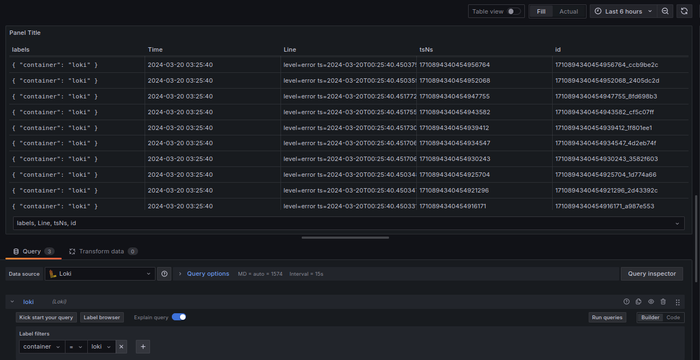
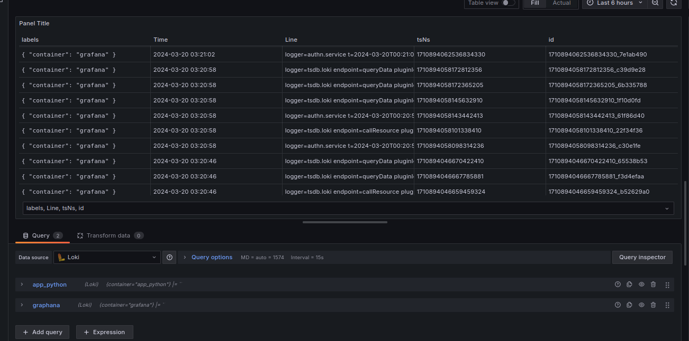
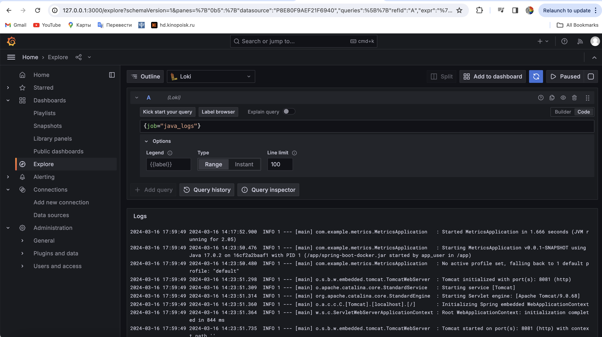
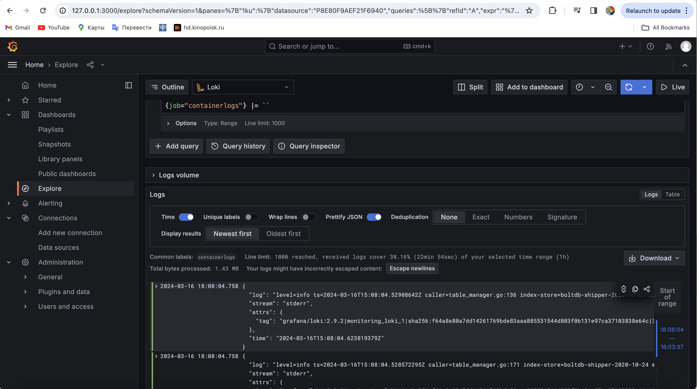

## Monitoring components

The following components that make the monitoring possible: 
* **Loki** is the service aggrgating the logs. It accepts the logs from promtail, aggregates them and stores them. It also serves the logs for Grafana when it requests them 

* **Promtail** is an agent that sits next to the application server and scrapes logs by some rule. In our case, it scrapes all the log satisfying the path `/var/log/*log` and sends them to the aggregating service (loki)

* **Grafana** requests the logs from the datasource (in our case it's loki) and disaplays them 

## Extra task: 
* I also included a job for the java_app 

* And a job for all the other logs 
