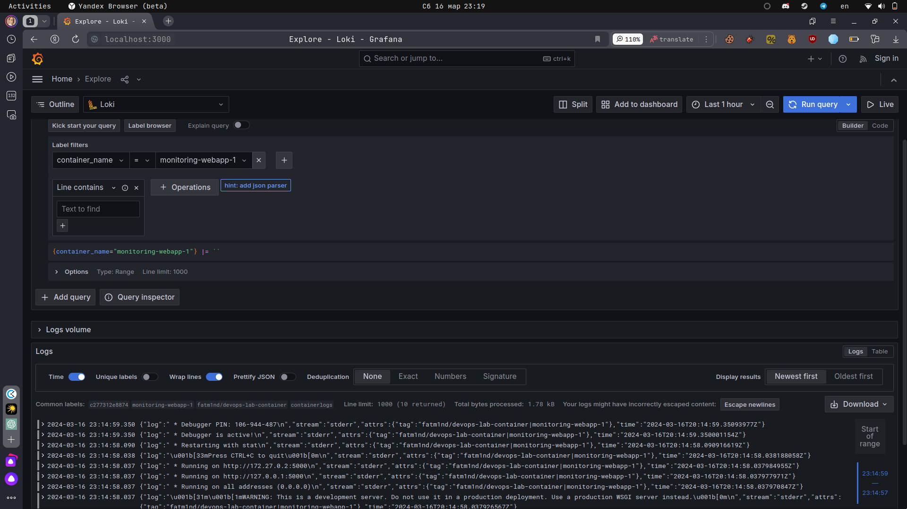
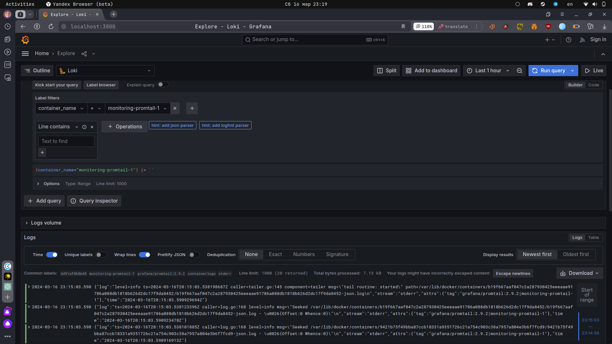
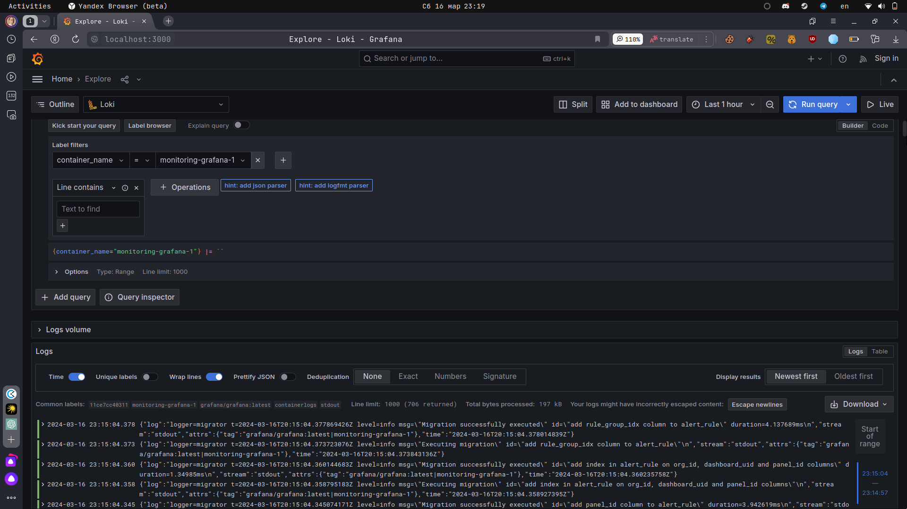
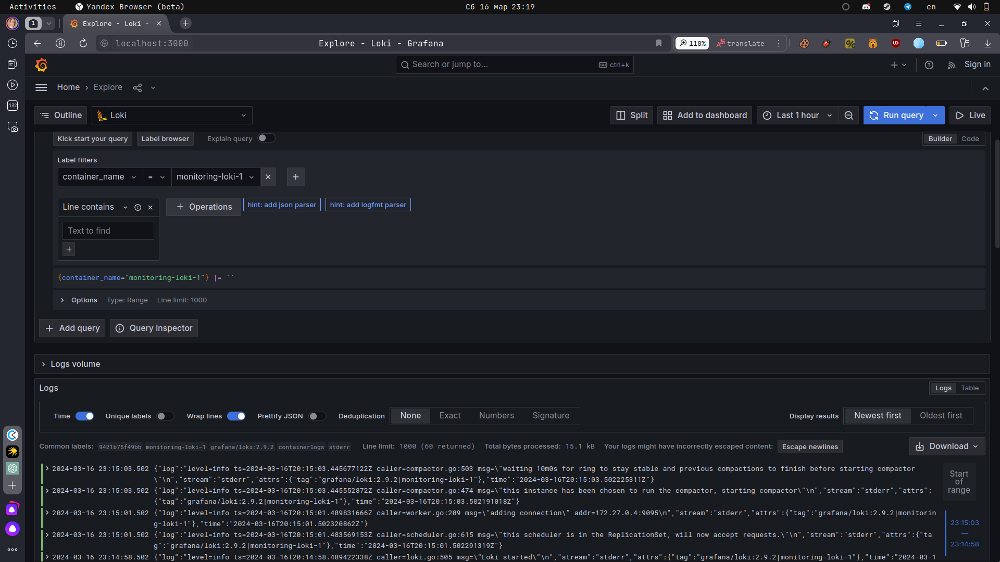

# Logging Stack Report

This document outlines the architecture and functionality of the logging stack that has been set up. The logging stack consists of Prometheus, Promtail, Loki, Grafana, and Docker containers.

## Components:

### 1. Promtail:
- **Role**: Promtail is the log shipping agent for Loki. It is responsible for tailing log files from different sources, adding labels, and pushing them to Loki for storage and indexing.
- **Functionality**: Promtail collects logs from Docker containers, Kubernetes pods, or other sources, adds metadata labels, and forwards them to Loki.

### 2. Loki:
- **Role**: Loki is a horizontally-scalable log aggregation system. It stores log data in object storage and indexes only the metadata for efficient querying.
- **Functionality**: Loki indexes log metadata, stores log data in object storage (e.g., Amazon S3), and provides a query language (LogQL) for filtering and querying logs.

### 3. Grafana:
- **Role**: Grafana is an open-source analytics and monitoring platform. It provides visualization and dashboarding capabilities for monitoring metrics and logs collected by Prometheus and Loki.
- **Functionality**: Grafana allows users to create custom dashboards, visualize data from Prometheus and Loki, set up alerts, and perform ad-hoc querying using PromQL and LogQL.

### 4. Docker:
- **Role**: Docker is a containerization platform used to deploy and manage applications as lightweight containers.
- **Functionality**: Docker hosts the Prometheus, Promtail, Loki, Grafana, and other containers in the logging stack, providing isolation and scalability.

## Screenshots:

### WebApp Dashboard:

### Promtail Dashboard:

### Grafana Dashboard:

### Loki Logs in Grafana:

## Conclusion:

The logging stack efficiently collects metrics and logs from various sources, indexes them for quick retrieval, and provides powerful visualization and querying capabilities. It enables monitoring, troubleshooting, and performance analysis of applications and infrastructure components.