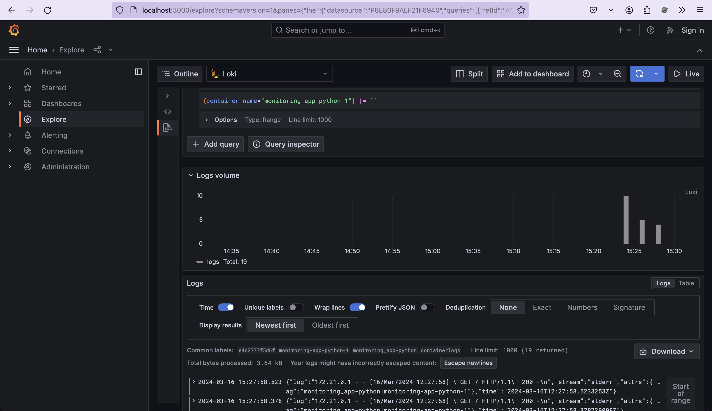
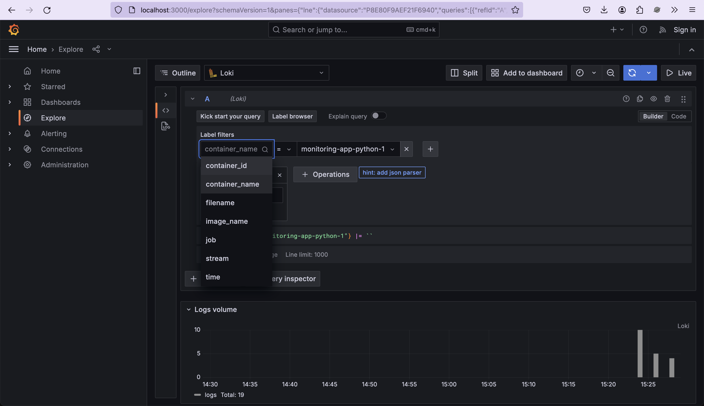

# Lab 7: Monitoring and Logging

The logging stack comprises several components working together to capture, aggregate, and visualize logs. Below, we detail each component's role:

### Promtail

**Role:** Responsible for scraping logs from Docker containers and forwarding them to Loki.

**Configuration:** Promtail is configured through promtail.yml to specify the Docker log paths and Loki endpoint.

### Loki

**Role:** A horizontally scalable, highly available log aggregation system.

**Configuration:** Loki's configuration is specified in local-config.yaml.

### Grafana

**Role:** Provides a user-friendly interface for log visualization and querying.

**Configuration:** Datasource configuration is provisioned using ds.yaml.

### Log Acquisition

The logging flow begins with Promtail scraping logs from Docker containers based on configured paths. Promtail then forwards these logs to Loki, where they are stored and indexed. Grafana queries Loki for log data and visualizes it on customizable dashboards.

### Log Flow

The `promtail.yml` configuration file sets up Promtail to scrape Docker logs
from `localhost`, process those logs, and send them to a Loki server.

Logs from my Python application:

Other screenshots of Grafana usage:

