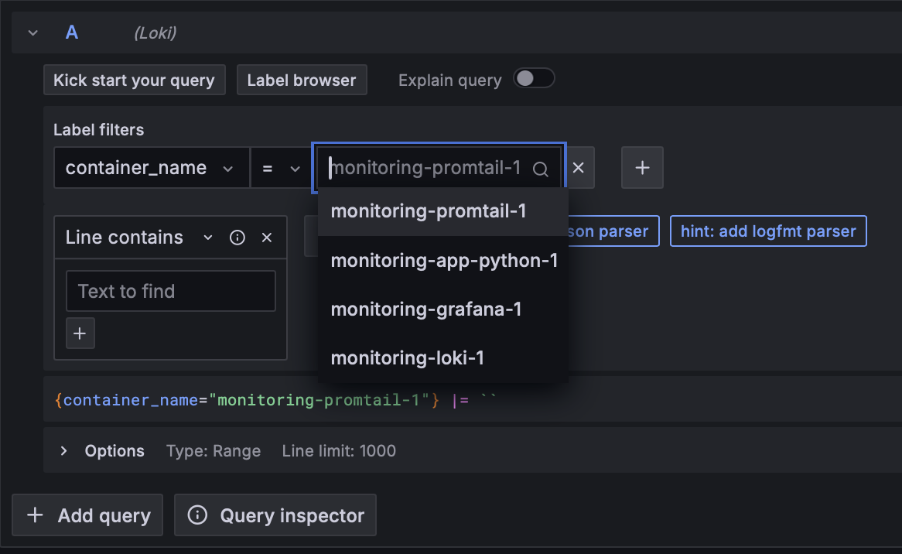

# Logging

This document provides an overview of the logging stack implemented using Docker Compose.

## Components

* `app-python`
* `loki`
* `promtail`
* `grafana`

## Functionality

* `app-python` container runs the Python application.
* `loki` container hosts Loki, a horizontally-scalable log aggregation system.
* `promtail` container collects logs from Docker containers and forwards them to Loki.
* `grafana` container provides a web-based visualization dashboard for viewing logs stored in Loki.

## App_python

Exposes port 5000 from the container to port 5001 on the host. This service hosts the Python application.

## Grafana

Exposes port 3000 from the container to port 3000 on the host. Creates a datasources configuration file for Grafana
connecting to Loki and starts the Grafana service. Utilizes the default logging configuration defined in x-logging. Logs
are stored in JSON format in files.

## Loki

Exposes port 3100 from the container to port 3100 on the host. It collects logs from various sources and stores them for
querying and analysis.

## Promtail

Mounts promtail.yml file and the Docker container logs directory.

