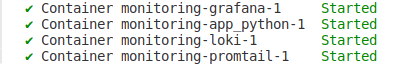
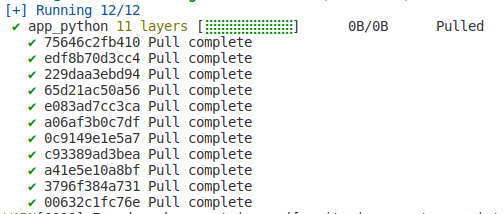

# Logging

## Loki

Acts as the central log storage system, responsible for ingesting and storing logs from Promtail. It processes queries to retrieve log data, enabling efficient search and retrieval capabilities.

## Promtail

Serves as the log collection agent, scraping logs from specified sources (e.g., local log files, systemd journal) and forwarding them to Loki. It attaches labels to log streams to facilitate easier querying and organization within Loki.

## Grafana

Provides a user interface for querying and visualizing log data stored in Loki. It integrates seamlessly with Loki, allowing users to explore logs through interactive dashboards and alerts.

## Python application

The application services generating logs. It is configured to use the json-file logging driver, which outputs logs in a JSON format. These logs are collected by Promtail and stored in Loki, where they can be queried and visualized through Grafana.

## Screenshots

### 4 Containers:

### Docker python app:

### Grafana:

