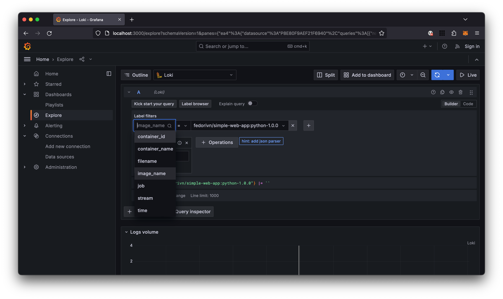
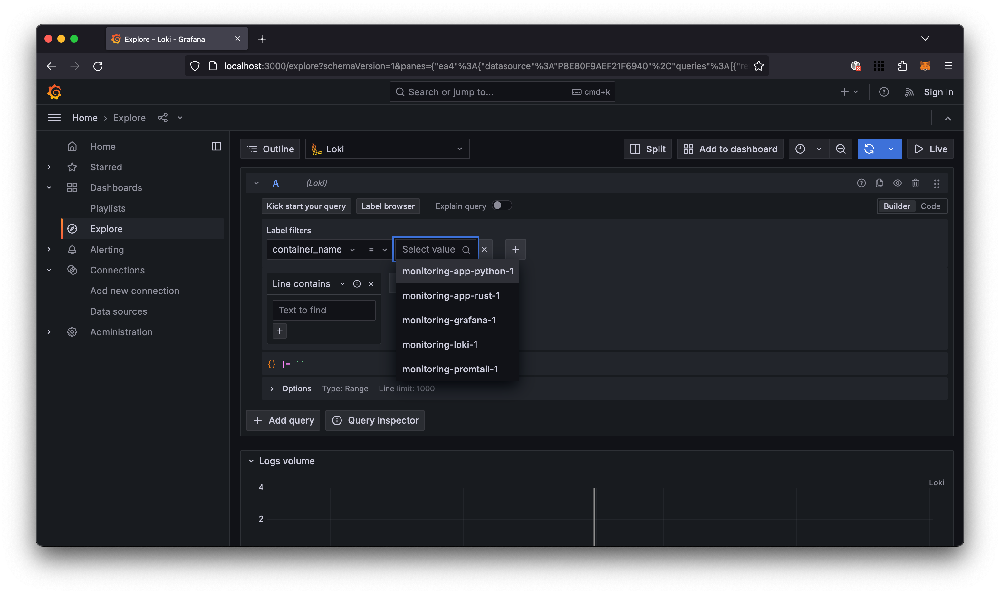
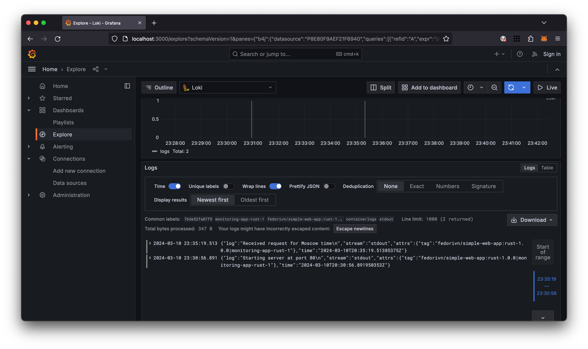
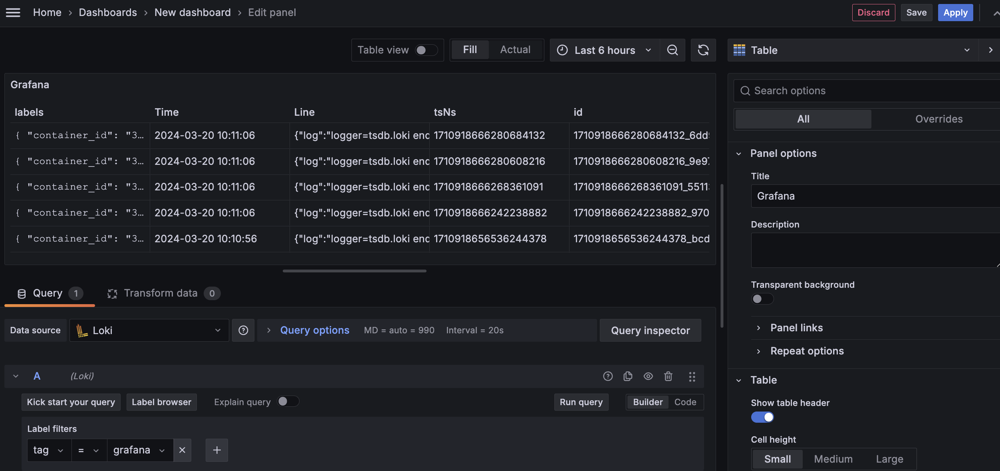
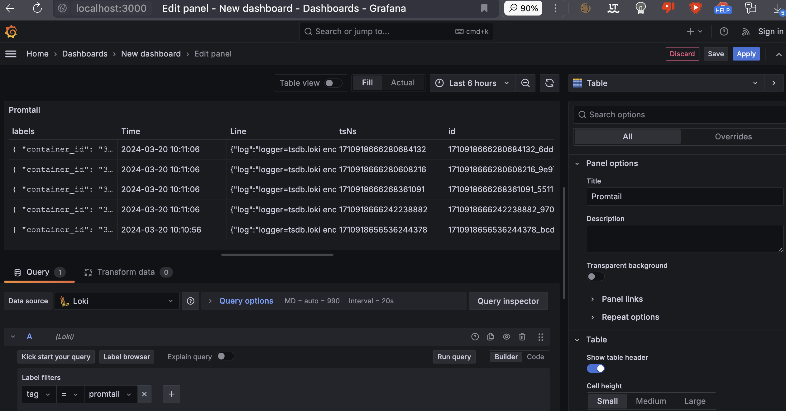
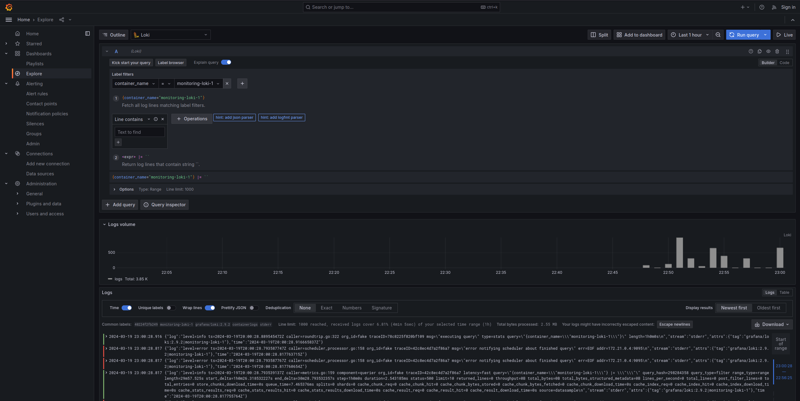

# Loggging

## Log Management Infrastructure

### Components

- **Grafana** is a tool that provides a graphical user interface for log/metric
  visualization, offering a wide range of configurations for data aggregation
  and visualization techniques.

- **Loki** is a system designed for efficient log aggregation.

- **Promtail** is an agent responsible for transferring local log content to
  **Loki**.

All of these tools are part of the same stack and are designed to work together.

### Log Acquisition

Logs are collected from all active docker containers by **Promtail**. Containers
have the same logging configuration and are configured to output logs in the
following JSON format:

```json
{
  "log": "log message from the application",
  "stream": "stdout",
  "attrs": {
    "tag": "image_name|container_name"
  },
  "time": "yyyy-mm-ddThh:mm:ss.nsZ"
}
```

### Log Parsing

The `promtail.yml` configuration file sets up Promtail to scrape Docker logs
from `localhost`, process those logs, and send them to a Loki server.

What is mostly important in the `promtail.yml` configuration file is the
`scrape_configs` section, which specifies the configuration for how Promtail
finds and processes log files. In this case, it's set up to process Docker logs
and groupes them by: `stream`, `time`, `image_name`, `container_name`,
`container_id`.

## Screenshots

1. Labels dropdown
    

1. Label values dropdown
    

1. `app_python` logs
    

1. `app_rust` logs
    

1. `grafana` logs
    

1. `promtail` logs
    

1. `loki` logs
    
