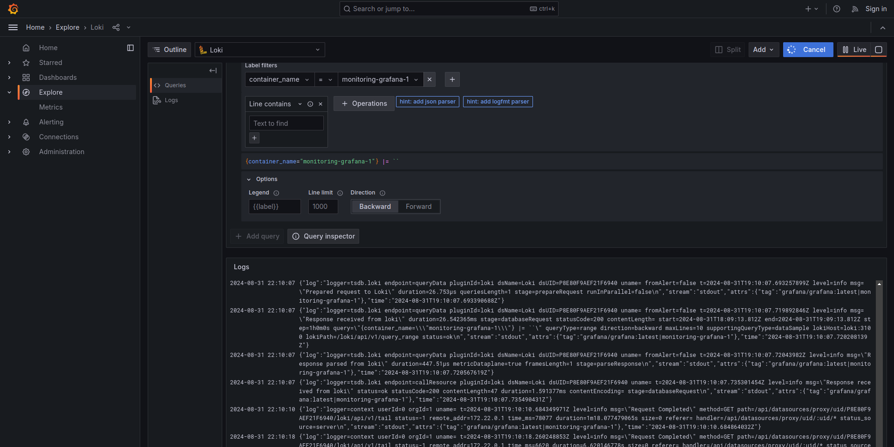

# Loggingstack

## Grafana

- Grafana is a tool for monitoring 
- Grafana can be used to: query, alert, and visualize metrics
- In this setup, Grafana is used for monitoring logs from Loki

## Loki

- Loki is a log aggregation system designed to store and query logs from all your applications and infrastructure.
- Loki is a horizontally-scalable, highly-available system
- In this setup, Loki indexes logs in the application

## Promtail

- Promtail is an agent which ships the contents of local logs to a private Grafana Loki instance or Grafana Cloud
- In this setup, Promtail is responsible for collecting Logs from apaplications and send them to Loki

## Screenshots

### Promtail shot

### Python app

### Loki shot

### Grafana shot

