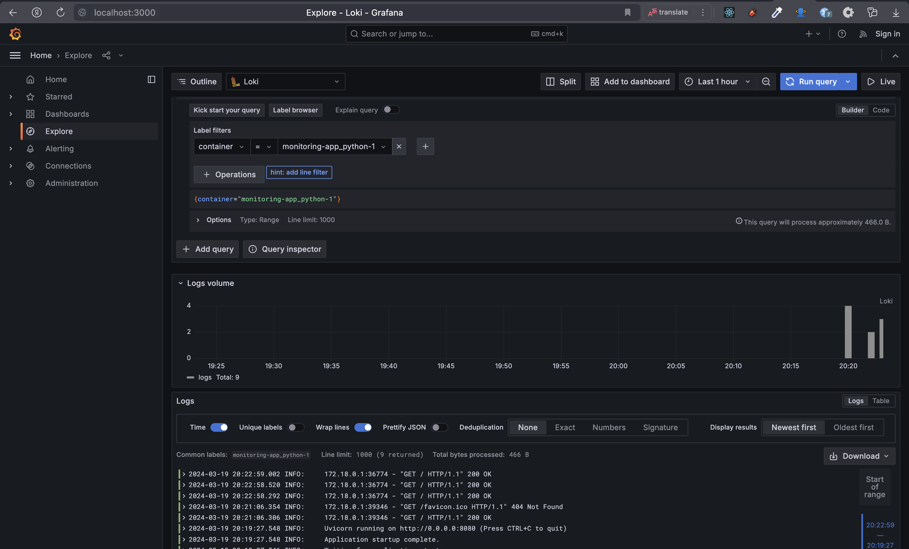

# Monitoring & Logging

1. app_python: A service built from the ../app_python directory with port mapping from 5000 to 5000. It is connected to the loki network and uses JSON file logging with a custom tag.

2. `loki`: A service running the Grafana Loki image (version 2.9.2) with port mapping from 3100 to 3100. It is connected to the loki network and uses the same JSON file logging configuration.

3. `promtail`: A service running the Grafana Promtail image (version 2.9.2) with volume mounts for log directories and a custom configuration file (promtail.yml). It is connected to the loki network and uses the JSON file logging configuration.

4. `grafana`: A service running the Grafana image (latest version) with environment variables set for anonymous access and provisioning configurations. It creates a datasource configuration for Loki and runs on port 3000. It is connected to the loki network and uses the JSON file logging configuration.

Docker Compose file sets up a logging stack with Grafana Loki for log aggregation, Promtail for log scraping, and Grafana for visualization and monitoring. The services are interconnected through the loki network and use a shared logging configuration for consistency.