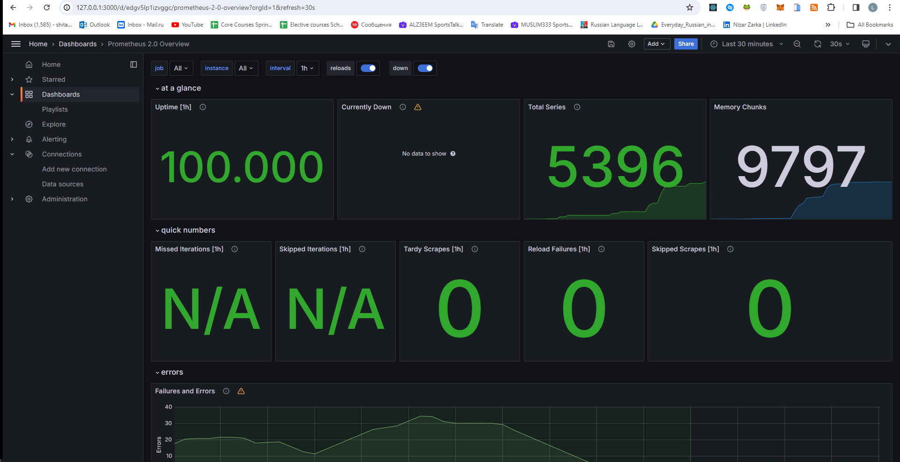
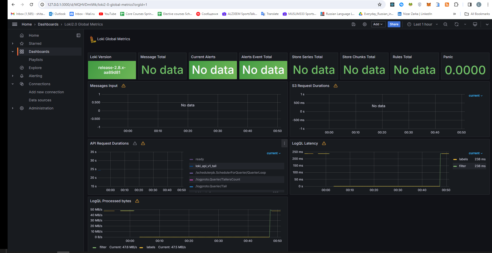

# App metrics

## Log rotation
I've instructed that the "json-file" driver be used to store logs in JSON format. By doing this, logs are guaranteed to be organized and simpler to analyze. I've also configured log rotation, so a log file will be rotated when it gets to be 15 megabytes in size. Additionally, I've set up log rotation to only keep a maximum of 10 log files
In `docker-compose.yml` I set a 15-file maximum for the total number of files and a 15-MB maximum for each file size.
```docker-compose
logging: 
    driver: "json-file"
    options:
        max-size: "15m"
        max-file: "10"
```

## App python

Prometheus is now a part of my Python application. It verifies that the Python app is operational and gathering data. 


## DashBoards






