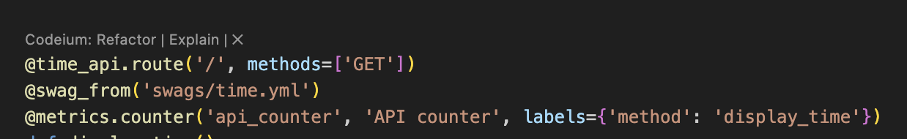
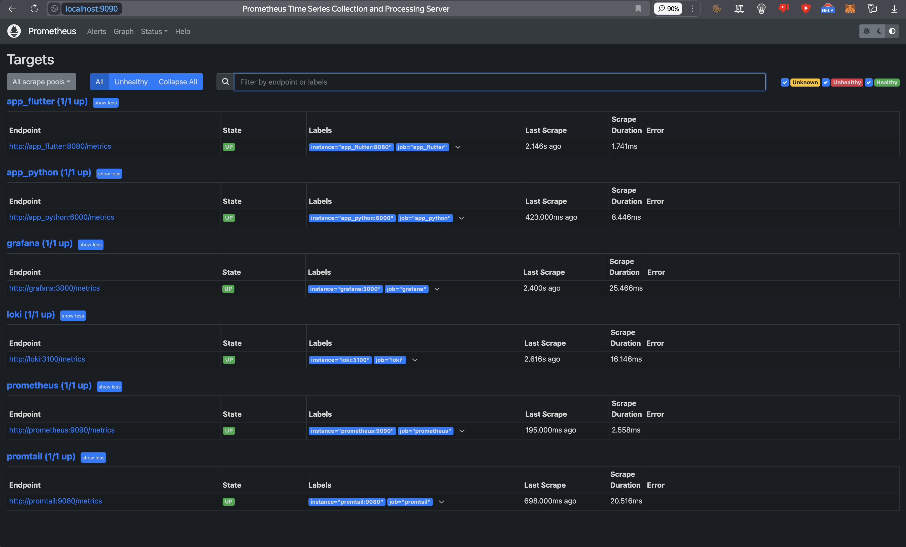
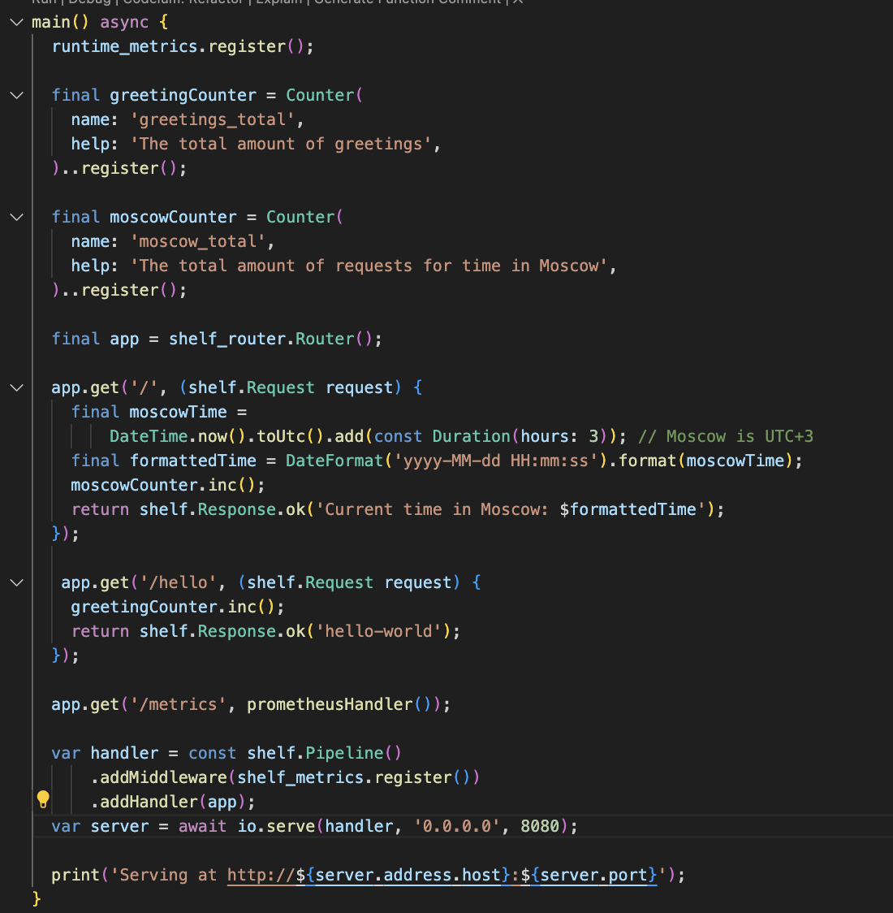
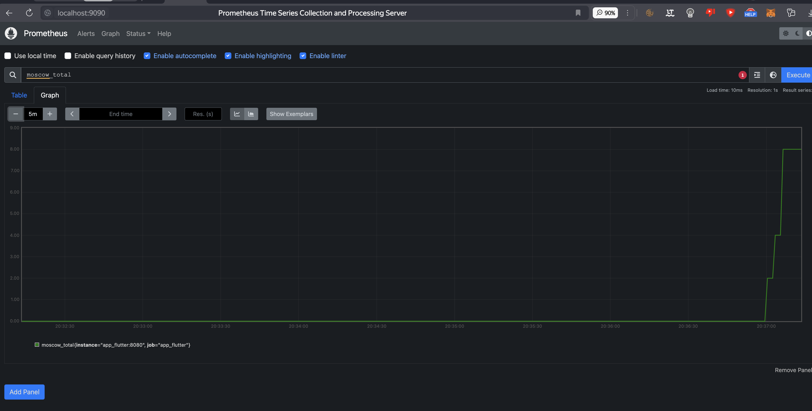
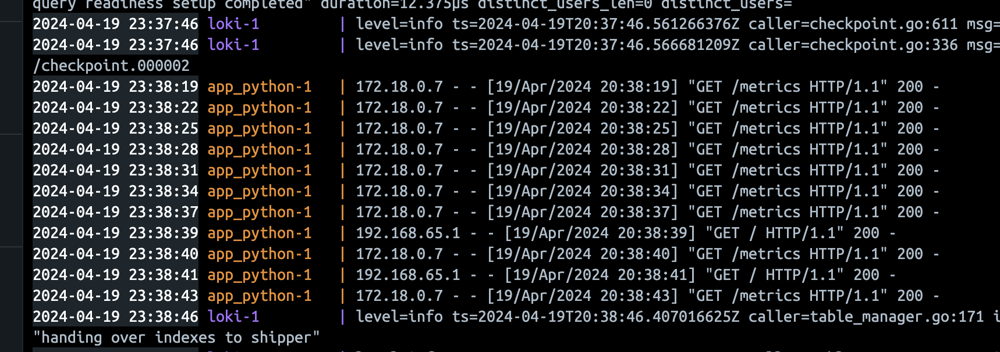

# Lab 8 

## Targets

## Loki dashboard

## Prometeus dashboard

## Logs and memory limits

## All working targets

## Add custom metrics

It is counter for request for this route

## For flutter part

I rewrite THE WHOLE APP to be not a client with flutter ui, to be dart server using shelf

### From this moment all targets are connected

Let's see flutter metrics

The metrics include:
- greetings_total: This counter keeps track of the total number of greetings. It is incremented each time the /hello endpoint is accessed.
- moscow_total: This counter keeps track of the total number of requests for time in Moscow. It is incremented each time the root / endpoint is accessed.

And now we have...

And this

