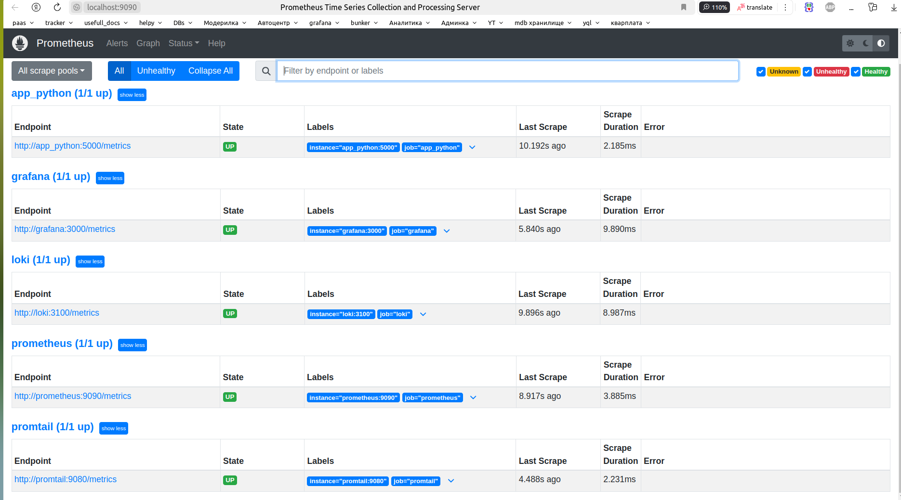
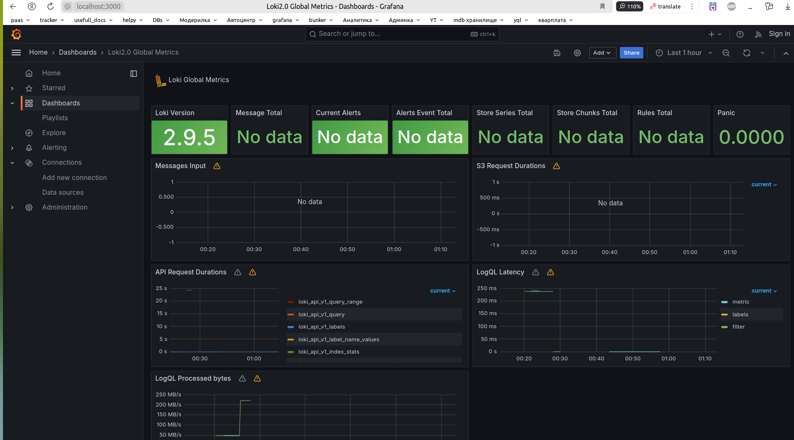
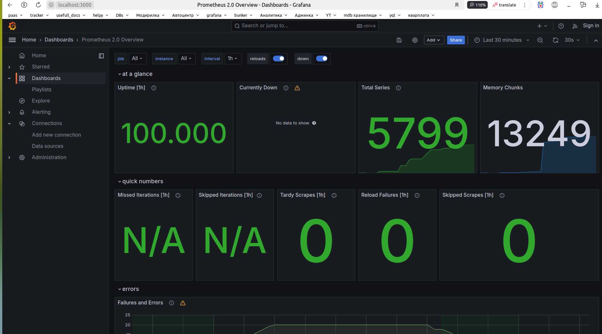

## Part 1
1. I added prometheus to the docker compound file.

2. Next, I created the prometheus file.yml and added the necessary dependencies to it.

3. I checked if the services are working in http://localhost:9090/targets :




## Part 2
1. I change file app.py (add endpoint `.../metrics`)
2. After, I push new docker image into my docker repo
3. Setup grafana, adding dashboards:



## Enhancements

`x-logging`:
```
x-logging:
  &default-logs
  driver: "json-file"
  options:
    tag: '{{.ImageName}}|{{.Name}}'
    max-size: '50m'
    max-file: '5'
```


`x-deploy`:

```
x-deploy:
  &default-deploy
  resources:
    limits:
      memory: 400m
```