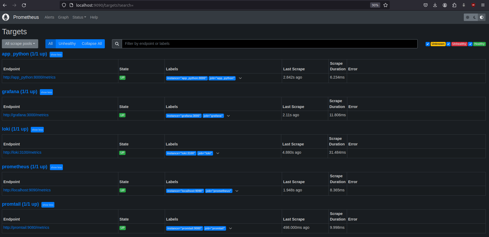

# Prometheus Metrics Setup

This document outlines the setup and verification of Prometheus metrics collection.

## Target Verification

After configuring Prometheus with `docker-compose.yml` and adding the necessary configuration in `prometheus.yml`, we verified the targets for monitoring services.

### List of Targets

Prometheus is set up to collect metrics from the following services:

1. **Prometheus** (Prometheus itself, port `9090`)
2. **Promtail** (port `9080`)
3. **Loki** (port `3100`)
4. **Grafana** (port `3000`)

### Screenshots

#### 1. Prometheus Targets Status

The screenshot below shows that all targets are in an **UP** state, confirming that Prometheus is successfully connected to each service.

