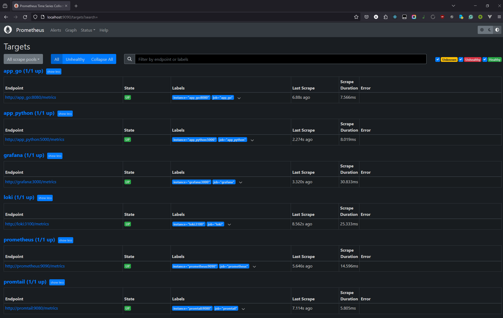
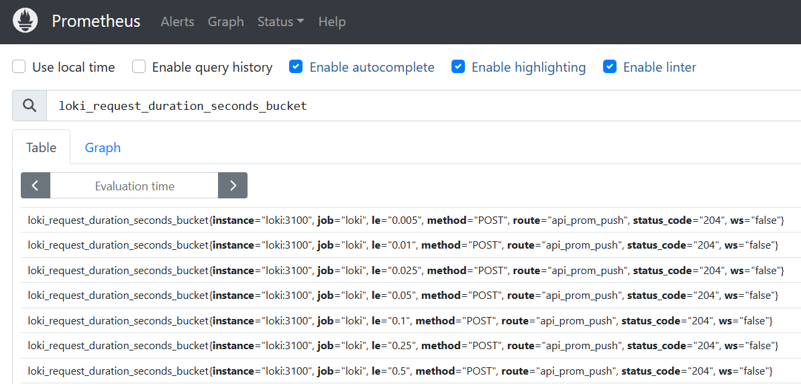
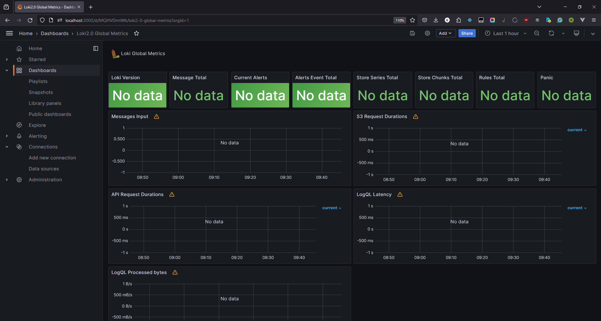
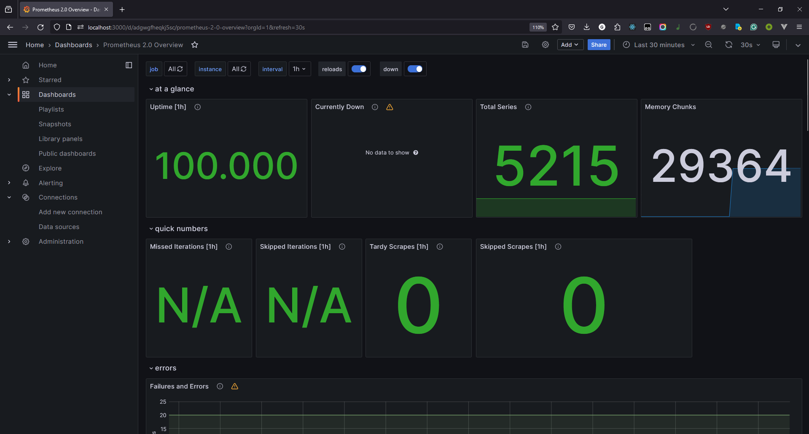
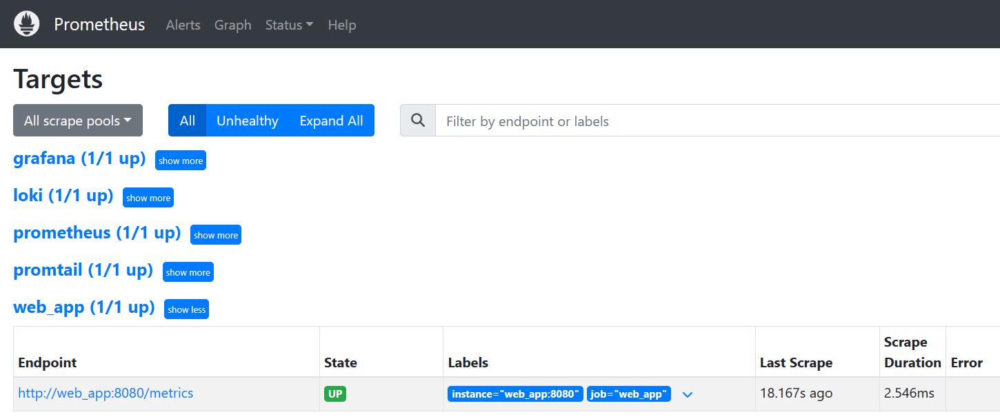
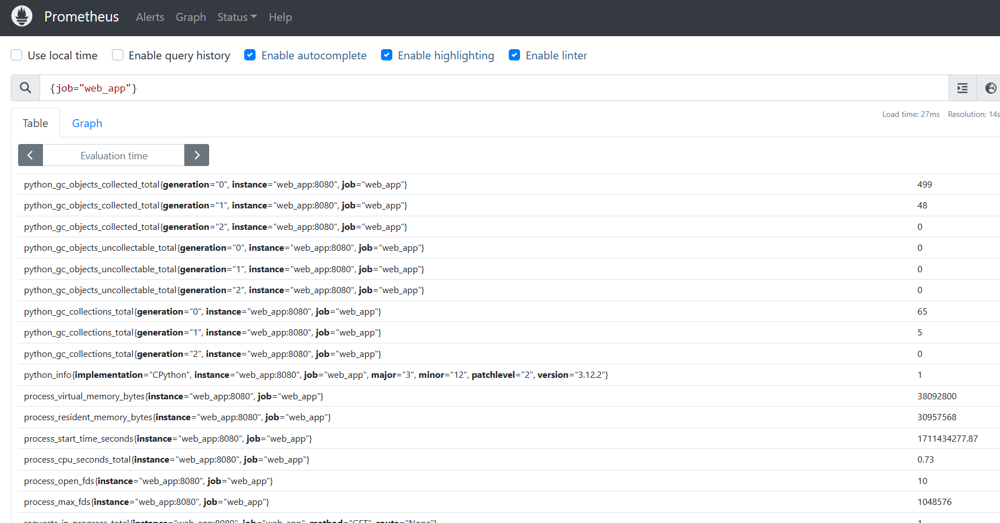

# Metrics

## Prometheus

Here are a few screenshots showing that Prometheus is set up correctly.

## Dashboards

Here are screenshots of Granafa dashboards for Loki and Prometheus.

## Log rotation

Every service is configured to rotate logs after reaching 200KB in size. At most
10 log files are retained.

## Memory limits

Web app containers have a limit of 30MB of memory. Services from the logging
stack are allowed to take up to 100MB of memory each. These numbers were derived
from actual memory usage.

## Web app metrics

Since I use the `aiohttp` framework, I used the `aiohttp_metrics` library to
integrate metrics. It already includes metrics such as
`request_latency_seconds_count` without any special setup. Here are some
screenshots of the web app's metrics in Prometheus.

