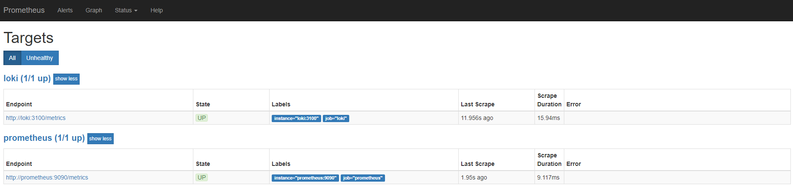
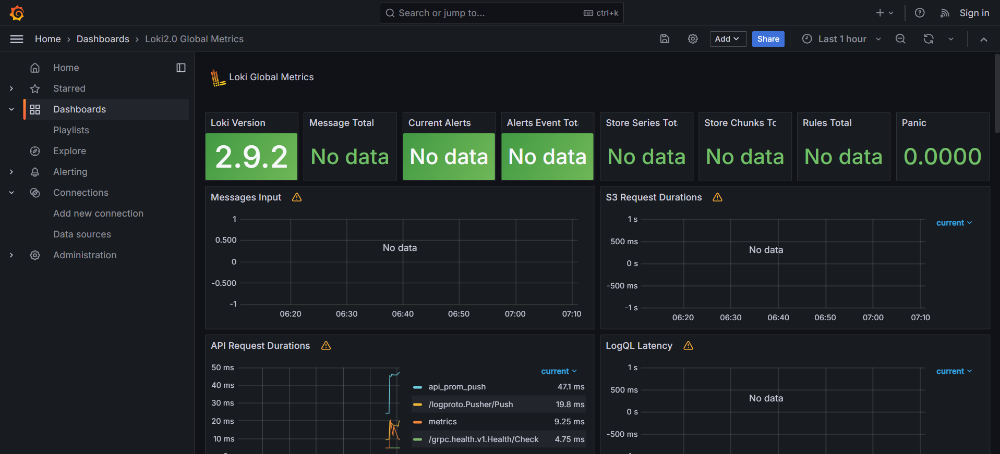
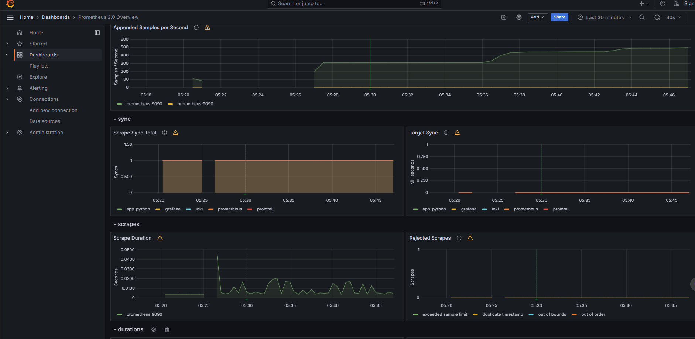
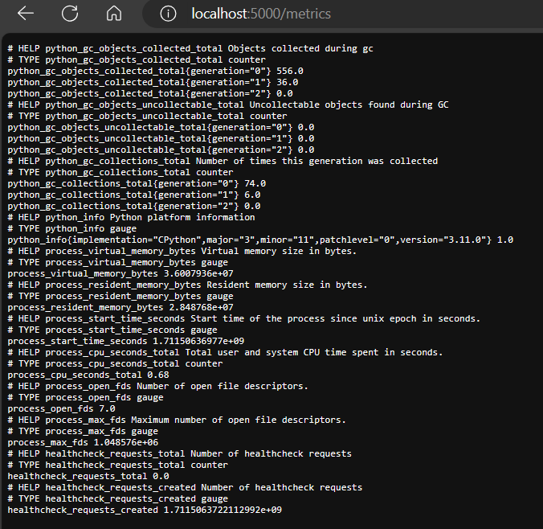

# About metrics

## Screenshot of prometheus targets



## Screenshot of Loki Dashboard



## Screenshots of Prometheus Dashboard




## Enhancements

### Log rotation (used in each service in logging: options:)

```yml
max-size: "10m"
max-file: "5"
```

### Memory limit (was added by x-deploy)

```yml
x-deploy: &default-deploy
  resources:
    limits:
      memory: 100M

<service-name>:
    deploy: *default-deploy
```

## Apllications metrics (configured by following code) (Bonus)

```python
@app.route('/metrics')
def metrics():
    return Response(generate_latest(), content_type='text/plain')
```


