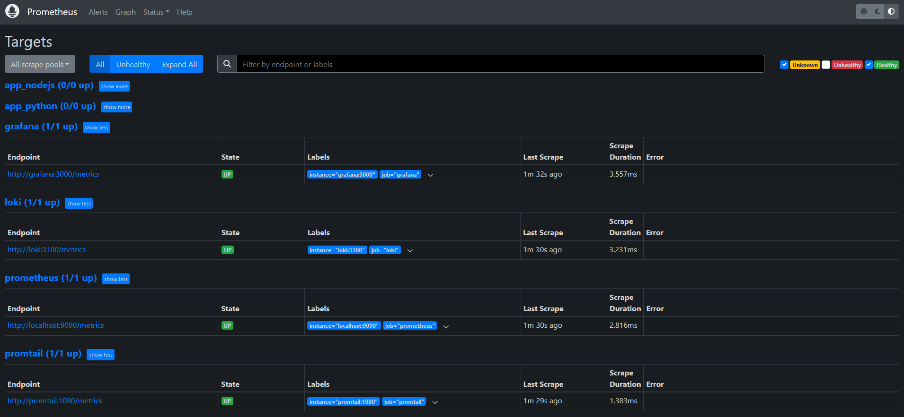
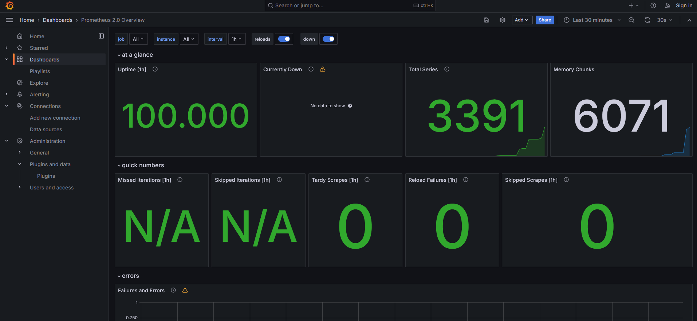
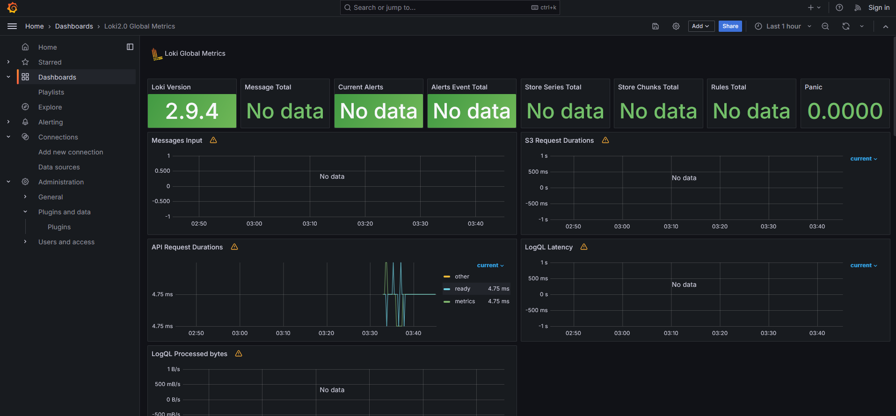

# Metrics

## Prometheus setup



All docker containers have been configured successfully - Prometheus is correctly scraping metrics.


## Dashboard for Prometheus



## Dashboard for Loki




### Docker Compose setup

- For log rotation I have added `max-size`/`max-file`:
```yaml
x-logging:
  &default-logging
  driver: "json-file"
  options:
    tag: '{{.ImageName}}|{{.Name}}|{{.ImageFullID}}|{{.FullID}}'
    max-size: '50m'
    max-file: '3'
```

- For memory limits I have described `x-deploy`:
```yaml
x-deploy:
  &default-deploy
  resources:
    limits:
      memory: 200M
```
