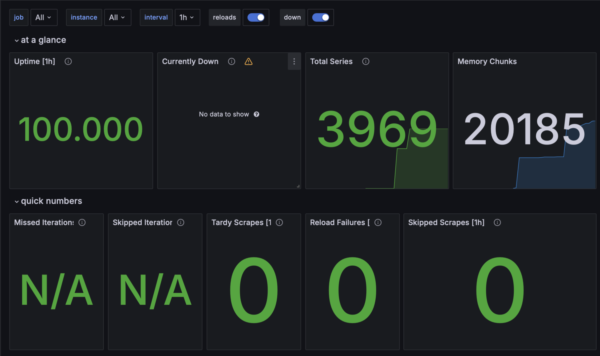

# Metrics

## Prometheus dashboard



Prometheus is correctly aggregating metrics.


### Docker Compose setup

## healthcheck

```yml
healthcheck:
    test: [ "CMD-SHELL", " wget --no-verbose --tries=1 -O /dev/null http://localhost:9090/-/healthy || exit 1" ]
    interval: 10s
    timeout: 5s
    retries: 5
```

## Log rotation

For log rotation I have added `max-size`/`max-file`:

```yml
x-logging:
  &default-logs
  driver: "json-file"
  options:
    tag: '{{.ImageName}}|{{.Name}}|{{.ImageFullID}}|{{.FullID}}'
    max-size: '50m'
    max-file: '5'
```

## Memory limits

For memory limits I have described `x-deploy`:

```yml
x-deploy:
  &default-deploy
  resources:
    limits:
      memory: 1G
```
