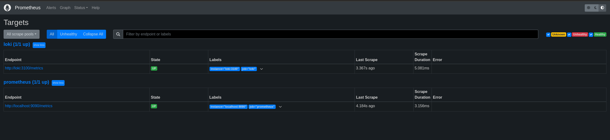
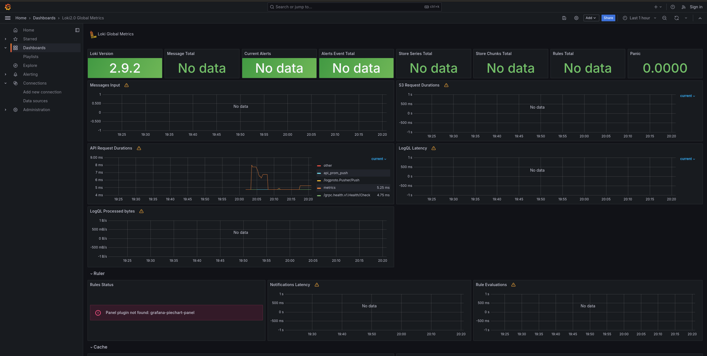
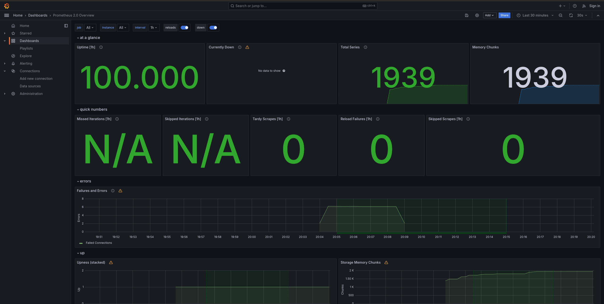

# Metrics

## Prometheus Targets
At this stage, Prometheus is configured to collect metrics
from Prometheus itself and Loki



## Grafana Dashboards
Here, we have Grafana dashboards for Loki and Prometheus.




Memory limits are specified in `docker-compose.yml` file

## Python Metrics Integration
I used prometheus_fastapi_instrumentator to expose metrics
in my FastAPI application. The metrics are available at
`/metrics` endpoint.

In `prometheus.yaml` file I specified `python_app` job to scrape metrics
```yaml
...
- job_name: python_app
  honor_timestamps: true
  scrape_interval: 15s
  scrape_timeout: 10s
  metrics_path: /metrics
  scheme: http
  static_configs:
  - targets:
    - python_app:8080
...
```
