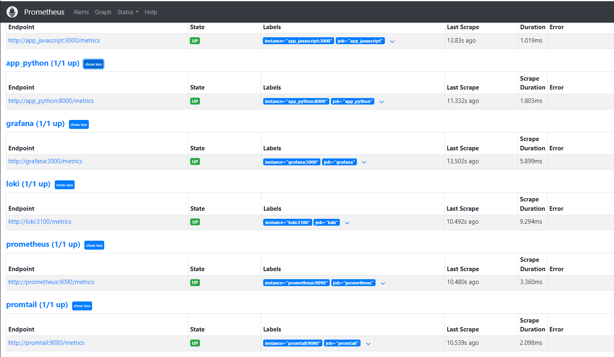
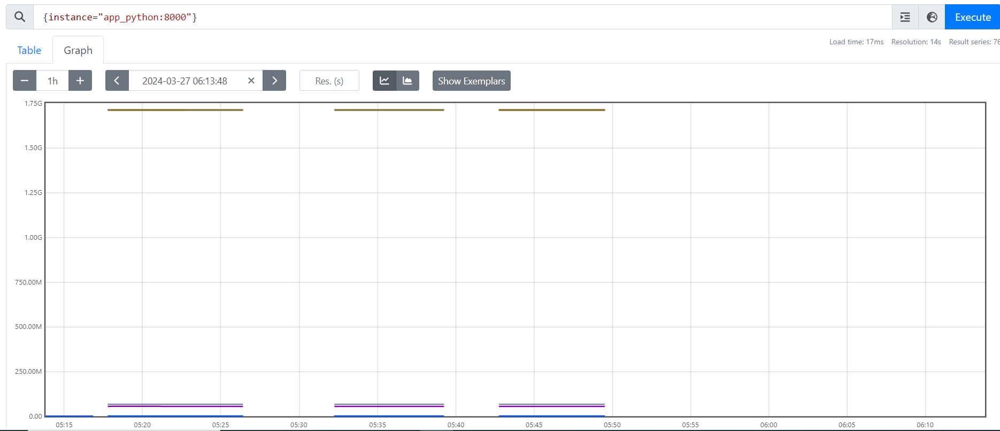
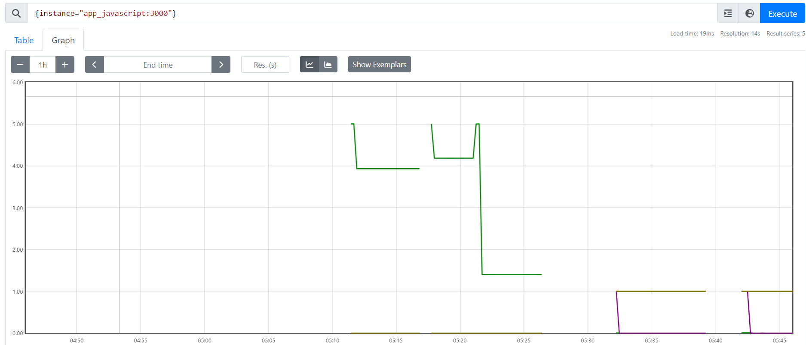

# Metrics


## Screenshots

### Prometheus targets



### Prometheus dashboard


### Loki dashboard


## Log rotation

The configuration was added to the logging parameters in the `docker-compose.yml` file to rotate the logs. Upper limit for amount is 5, size limit for each log file is 10MB.

```yml
max-size: "10m"
max-file: "5" 
```

## Memory limits

The configuration was added to the logging parameters in the `docker-compose.yml` file to set memory limits for each service.

```yml
deploy:
    resources:
      limits:
        memory: 100M
```


## Bonus


### Prometheus python

In Python, I used `prometheus_fastapi_instrumentator` to integrate the metrics. It exposed the `/metrics` endpoint that was later used by prometheus.




### Prometheus javascript

In Javascript, I used `express-prom-bundle` to integrate the metrics. Then I manually exposed the `/metrics` endpoint that was later used by prometheus.




### Healthchecks

I have added the healtcheck parameters to my services in `docker-compose.yml` file. Example:

```yml
test: ["CMD", "curl", "-f", "http://localhost:<port>"]
    interval: 1m30s
    timeout: 30s
    retries: 5
    start_period: 30s
