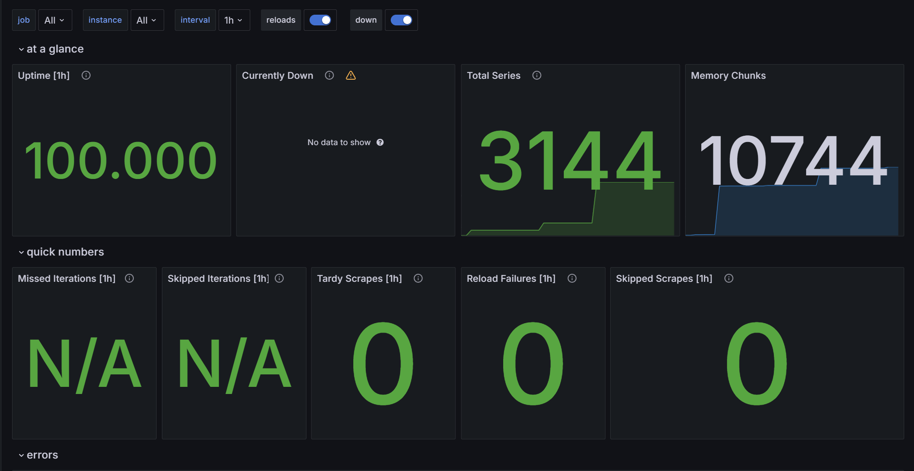
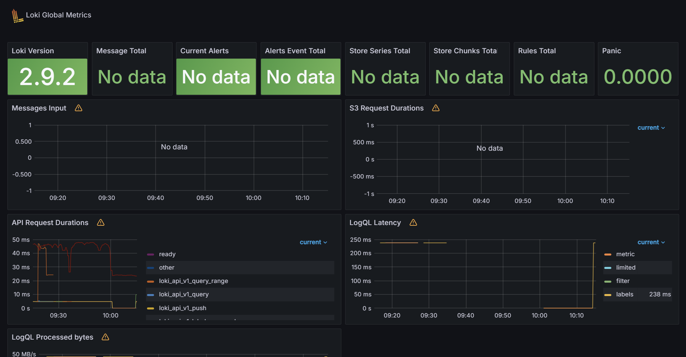
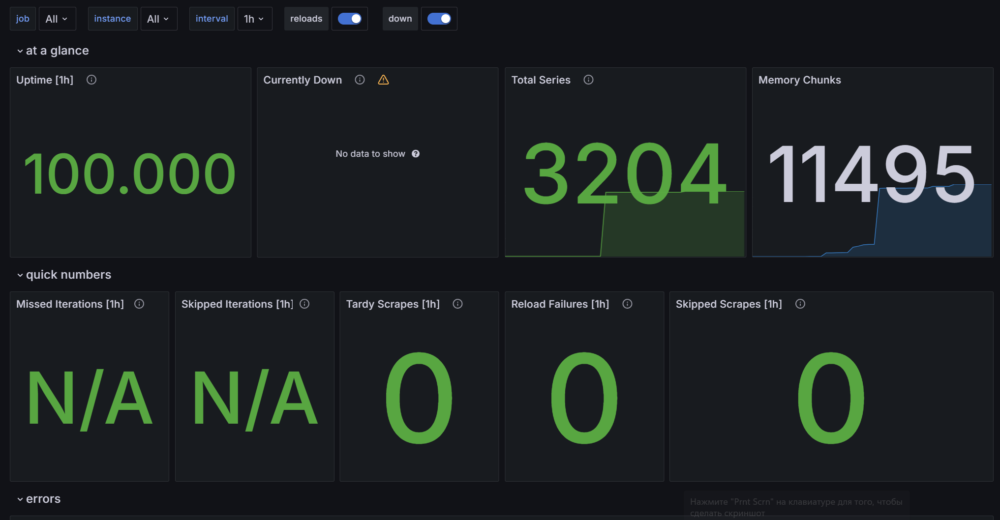
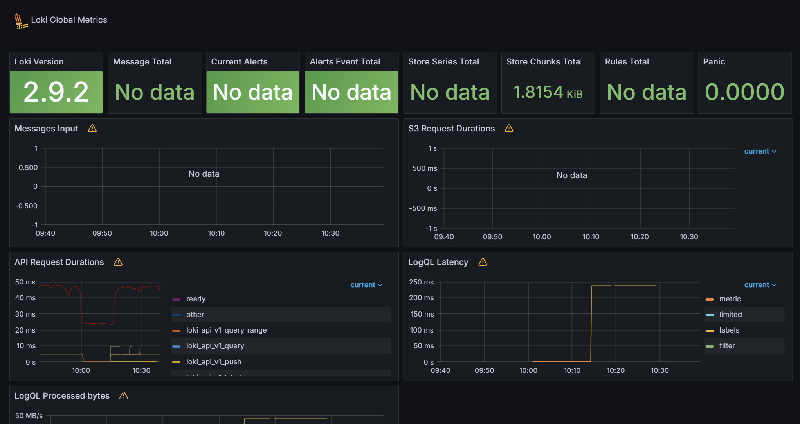

# Prometheus

# Grafana

Changes:

- For the 'promtail`service, a log rotation mechanism was added using the`json-file` driver with max-size: "10m" and max-file: "3"
- For the 'promtail` service a memory limit of 512 megabytes is set
- For the 'grafana` service a memory limit of 1 gigabyte is set
- For the 'promtail` service a memory limit of 2 gigabytes is set

## Extend Prometheus

