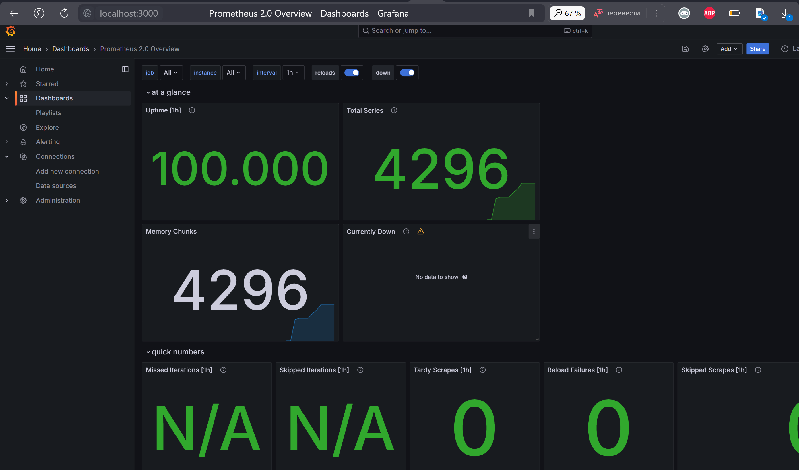
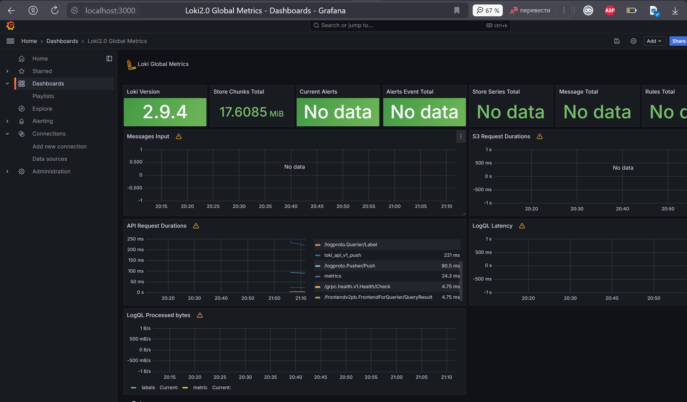

## Metrics

### Prometheus Targets


### Prometeus Dashboard



### Loki Dashboard



### Log rotation mechanisms

Changes have been made in x-logging, the max-size parameter restricts the size of log files to 10 megabytes, the max-file sets a maximum of 5 log files. Docker automatically creates new files when limits are reached.

```
x-logging: &default-logging
  driver: "json-file"
  options:
    max-size: "10m"
    max-file: "5"
    tag: "{{.ImageName}}|{{.Name}}"
```

### Memory limits for containers

Added x-deploy to docker-compose.yml to cap service memory usage at 100MB:

```
x-deploy: &default-deploy
  resources:
    limits:
      memory: 100M
```