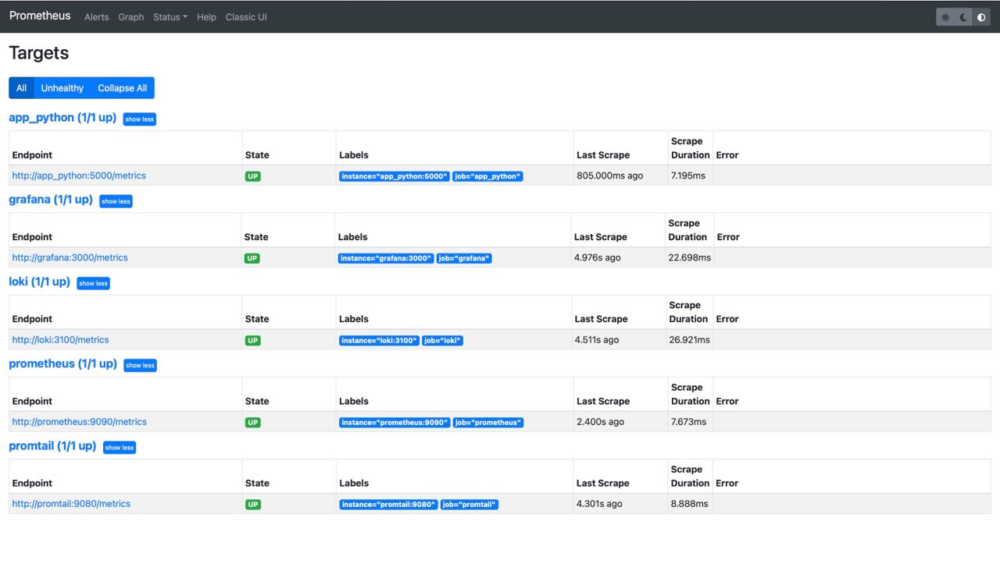
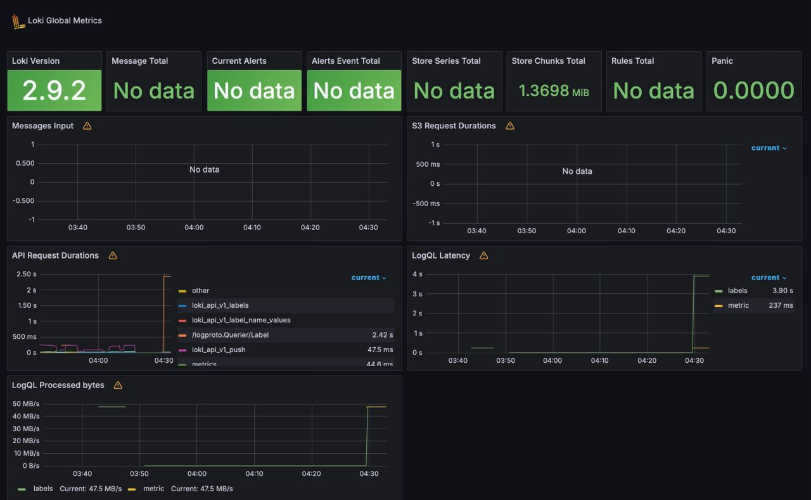
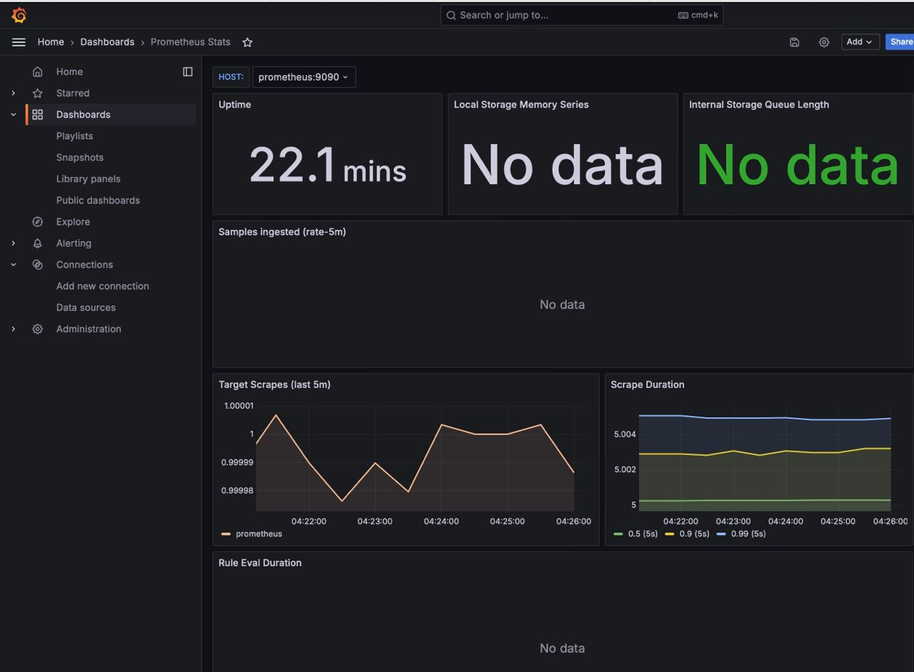

## All targets



## Loki dashboard



## Prometheus dashboard



## Log rotation

```yml
x-logging:
  &default-logging
  driver: "json-file"
  options:
    max-size: "5m"
    max-file: "3"
    tag: "{{.ImageName}}|{{.Name}}"
```
Here I used following options for log rotation:

- max-size: "5m": This sets the maximum size of each log file to 5 megabytes (5m).

- max-file: "3": This specifies that a maximum of 3 log files will be kept.

## Memory limit

```yml
x-deploy:
  &default-deploy
  resources:
    limits:
      memory: 100M
```