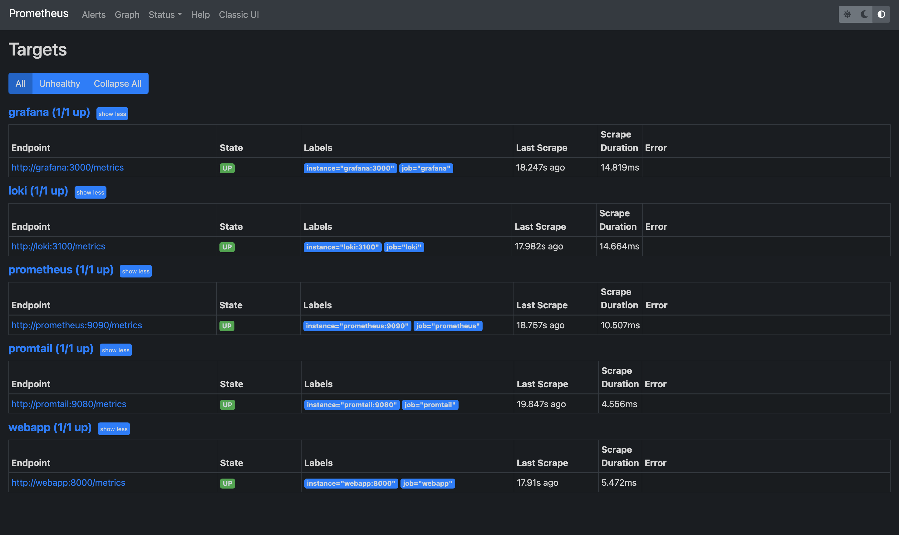
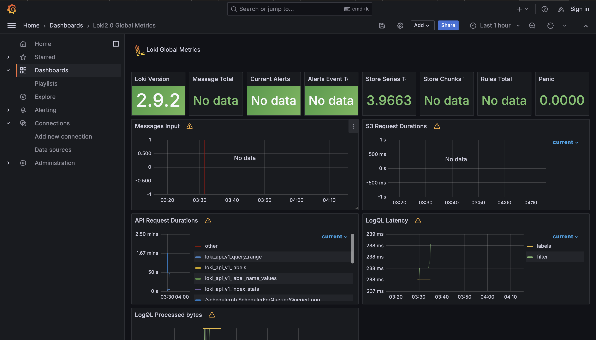
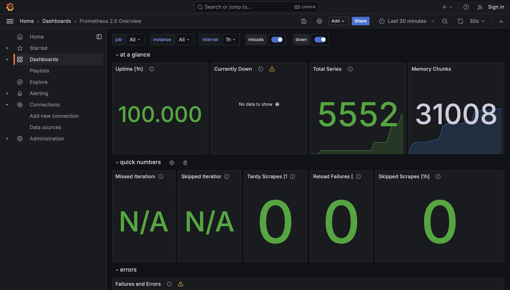
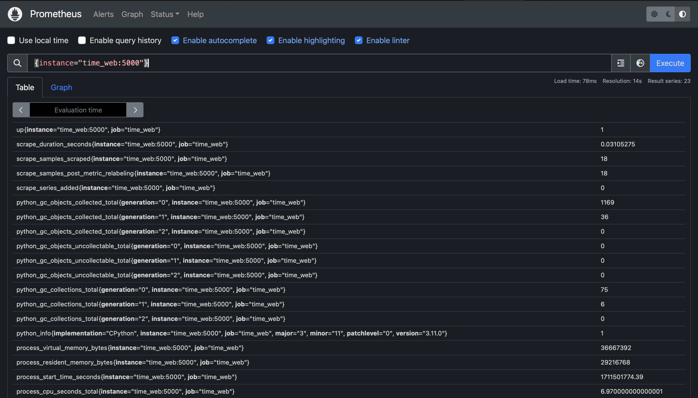

# Metrics

## Prometheus targets



## Loki Dashboard



## Prometheus Dashboard



## Enhancements

### Log rotation

```yml
max-size: "10m"
max-file: "5"
```

### Memory limits

```yml
x-deploy:
  &default-deploy
  resources:
    limits:
      memory: 200M

<any-service>:
    deploy: *default-deploy
```

## Metrics to application

```python
@app.route('/metrics')
def metrics():
    return Response(generate_latest(), content_type='text/plain')
```

```
"localhost:5000/metrics"

# HELP python_gc_objects_collected_total Objects collected during gc
# TYPE python_gc_objects_collected_total counter
python_gc_objects_collected_total{generation="0"} 1873.0
python_gc_objects_collected_total{generation="1"} 36.0
python_gc_objects_collected_total{generation="2"} 0.0
# HELP python_gc_objects_uncollectable_total Uncollectable objects found during GC
# TYPE python_gc_objects_uncollectable_total counter
python_gc_objects_uncollectable_total{generation="0"} 0.0
python_gc_objects_uncollectable_total{generation="1"} 0.0
python_gc_objects_uncollectable_total{generation="2"} 0.0
# HELP python_gc_collections_total Number of times this generation was collected
# TYPE python_gc_collections_total counter
python_gc_collections_total{generation="0"} 76.0
python_gc_collections_total{generation="1"} 6.0
python_gc_collections_total{generation="2"} 0.0
# HELP python_info Python platform information
# TYPE python_info gauge
python_info{implementation="CPython",major="3",minor="11",patchlevel="0",version="3.11.0"} 1.0
# HELP process_virtual_memory_bytes Virtual memory size in bytes.
# TYPE process_virtual_memory_bytes gauge
process_virtual_memory_bytes 3.6675584e+07
# HELP process_resident_memory_bytes Resident memory size in bytes.
# TYPE process_resident_memory_bytes gauge
process_resident_memory_bytes 2.9216768e+07
# HELP process_start_time_seconds Start time of the process since unix epoch in seconds.
# TYPE process_start_time_seconds gauge
process_start_time_seconds 1.71150177439e+09
# HELP process_cpu_seconds_total Total user and system CPU time spent in seconds.
# TYPE process_cpu_seconds_total counter
process_cpu_seconds_total 7.220000000000001
# HELP process_open_fds Number of open file descriptors.
# TYPE process_open_fds gauge
process_open_fds 6.0
# HELP process_max_fds Maximum number of open file descriptors.
# TYPE process_max_fds gauge
process_max_fds 1.048576e+06
# HELP healthcheck_requests_total Number of healthcheck requests
# TYPE healthcheck_requests_total counter
healthcheck_requests_total 0.0
# HELP healthcheck_requests_created Number of healthcheck requests
# TYPE healthcheck_requests_created gauge
healthcheck_requests_created 1.7115017762041378e+09
```


