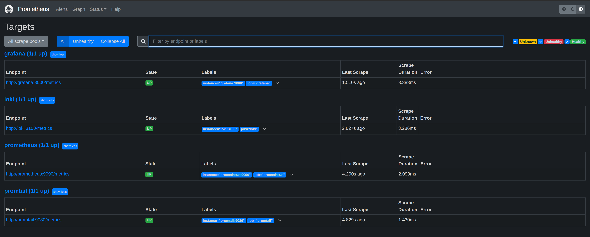

# Metrics

## Run

`docker-compose.yml` contains all setups for running applications and checking the metrics.

Use `docker compose up -d` in order to run the system.

To check metrics, you can follow <https://localhost:9090>



## Healthcheck

In order to healthcheck all containers, the following block was added:

```yaml
x-healthcheck: &health-test
  interval: 15s
  timeout: 10s
  retries: 5
  start_period: 5s
```
