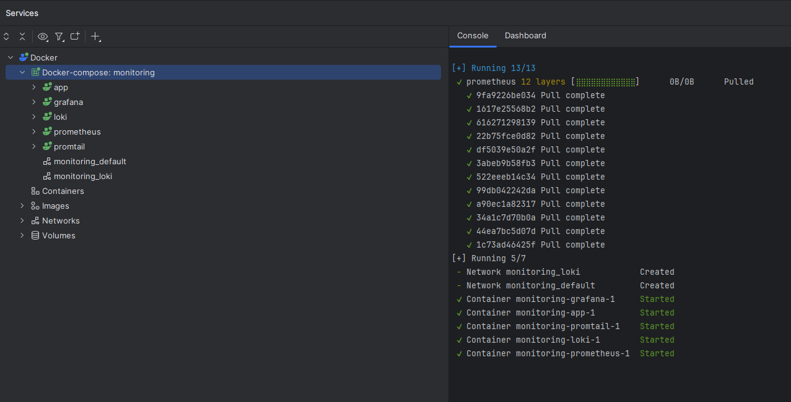

# Metrics for Python Application

## System setup



## Prometheus targets


## Grafana dashboards

### Loki


### Prometheus


## Container & Logging configuration

Every service is configured with the following settings:

```yaml
deploy:
  resources:
    limits:
      memory: 500M
logging:
  driver: "json-file"
  options:
    max-size: "200k"
    max-file: "10"
    tag: "{{.ImageName}}|{{.Name}}"
```

Every container is limited to 200M memory and uses JSON files as logging option. Log rotation consists of 10 last files each at most 200k in size.
