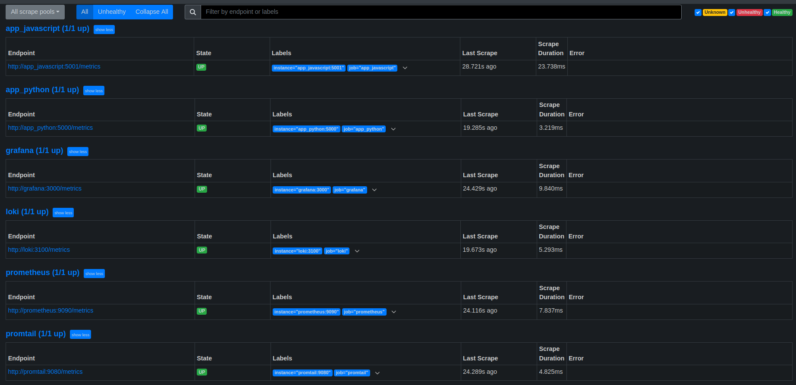
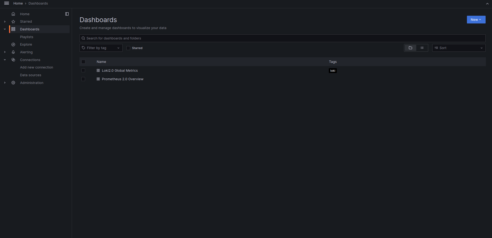
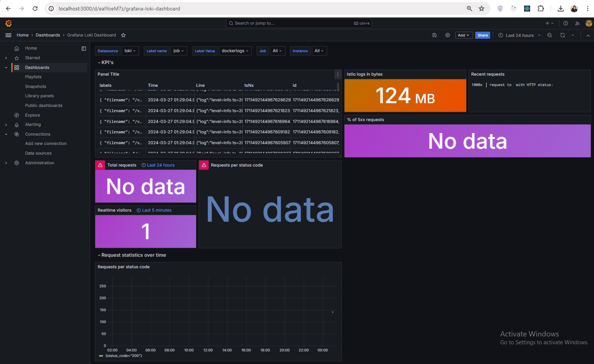
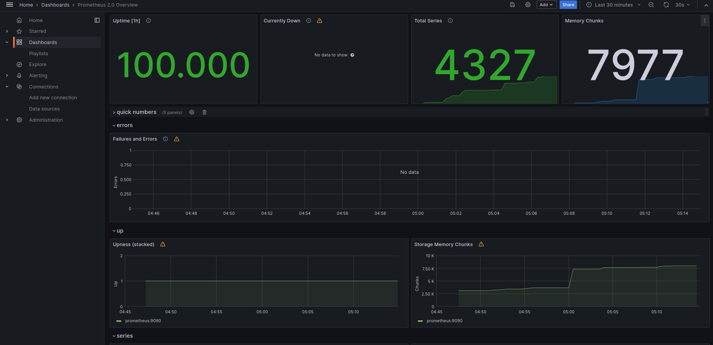
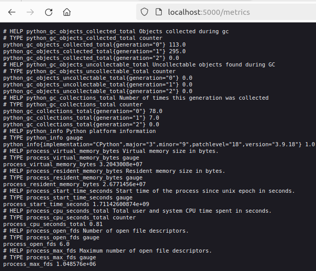
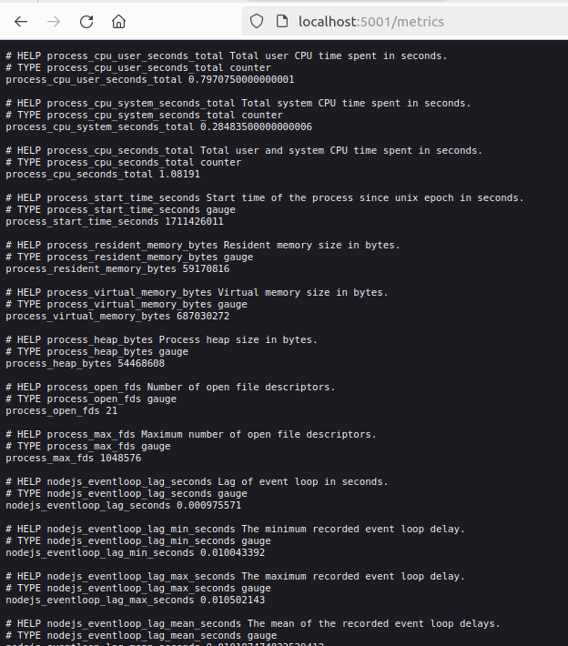
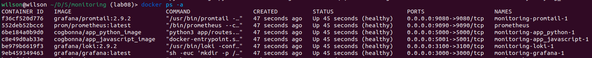

# Metrics 

## Prometheus Setup 
- Created `prometheus.yml` to scrape metrics from Loki and Prometheus containers every 10 seconds.
- Updated `docker-compose.yml` to include Prometheus as a sub-service.
- Integrated the prometheus client library into the `app_python` and `app_javascript` on the `/metrics` endpoint.
- Updated port for `app_javascript`
- Updated `docker-compose.yml` to use images from docker hub.

### `http://localhost:9090/targets`



## Dashboard and Configuration Enhancements
### Dashboards

### Dashboard (Loki)

### Dashboard (Prometheus)


## Log rotation
Added log rotation and memory limits for all services in the `docker-compose.yml` file: containers now have a memory limit of 200MB, and logs are rotated to 10 files, each with a size limit of 10MB.
```bash
x-deploy: &default-deploy
  resources:
    limits:
      memory: 200M

x-logging:
  &common_logging
  driver: "json-file"
  options:
    tag: "{{.ImageName}}|{{.ContainerName}}"
    max-size: "10M"
    max-file: "10"
```
## Application Metrics 
### app_python

### app_javascript


## Health check 
