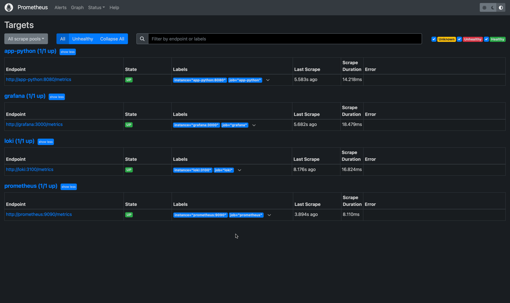

# Answers to Lab 8

## 1. Prometheus Targets Page

Metrics from all containers are being scraped by Prometheus.

## 2. Loki Dashboard

The Loki dashboard in Grafana displays metrics of Loki itself.

## 3. Prometheus Dashboard

The Prometheus dashboard in Grafana displays metrics of Prometheus itself.

## 4. Log rotation and memory limits.

Memory limit is equal to **800 mb** for each container.
Logs are rotated when the file size reaches **10 MB.**
