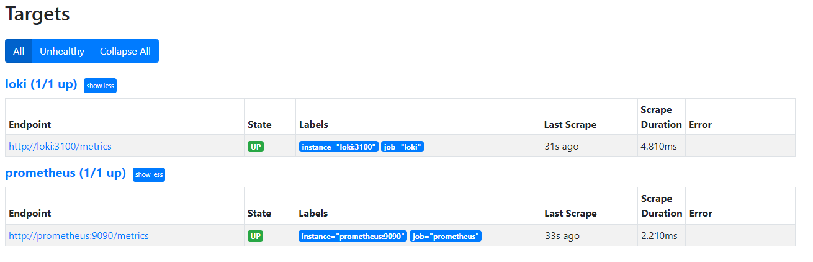

# Prometheus Targets

Prometheus collects metrics from Loki and Prometheus containers:



I have finished part 1 of this lab only.

I've also tried to solve the Task 2.2 in `docker-compose.yml`:

```
x-deploy:
  &default-deploy
  resources:
    limits:
      memory: 100M
```