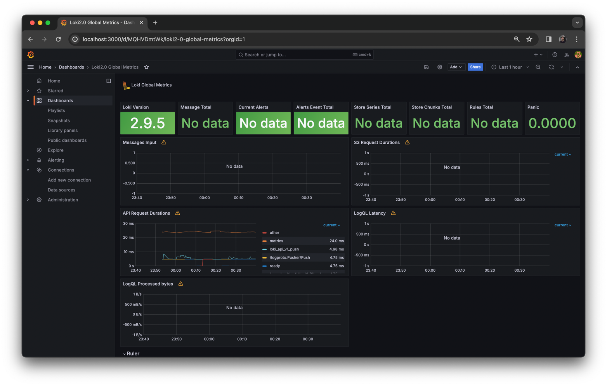
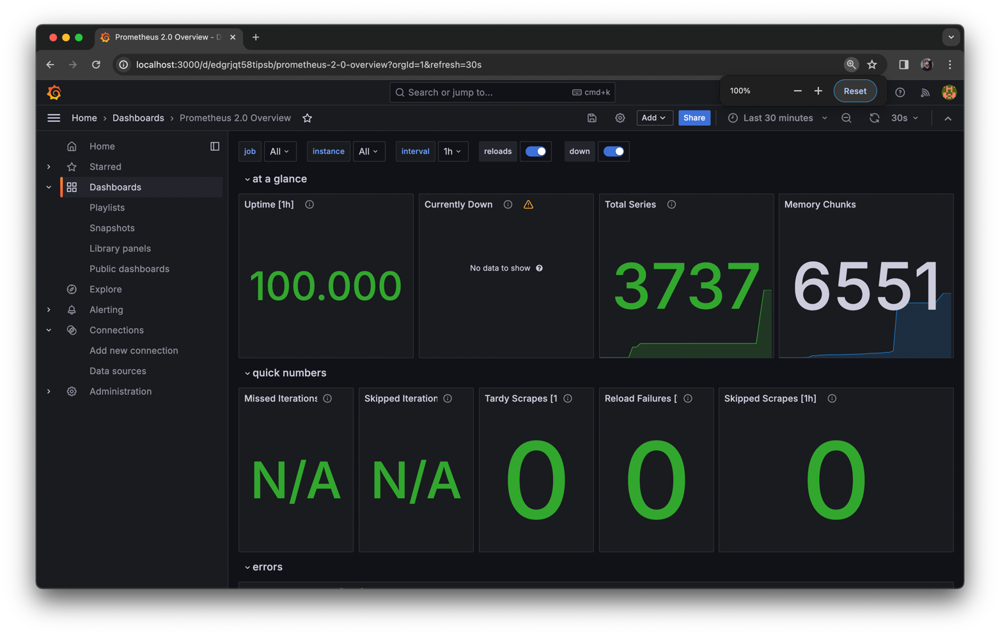
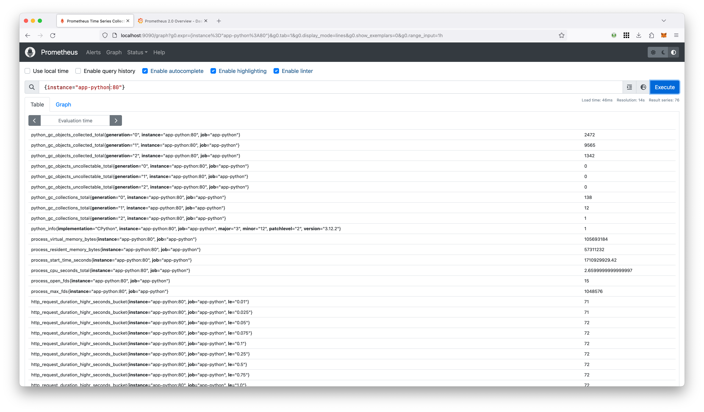
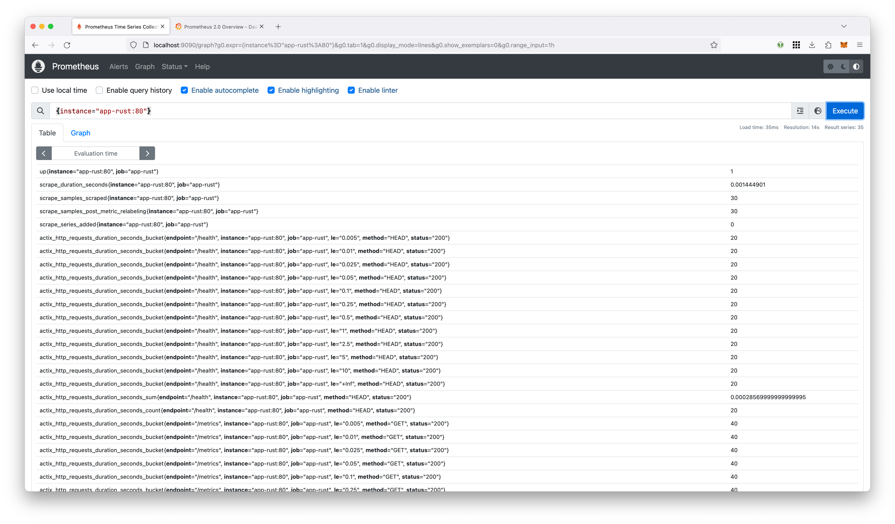
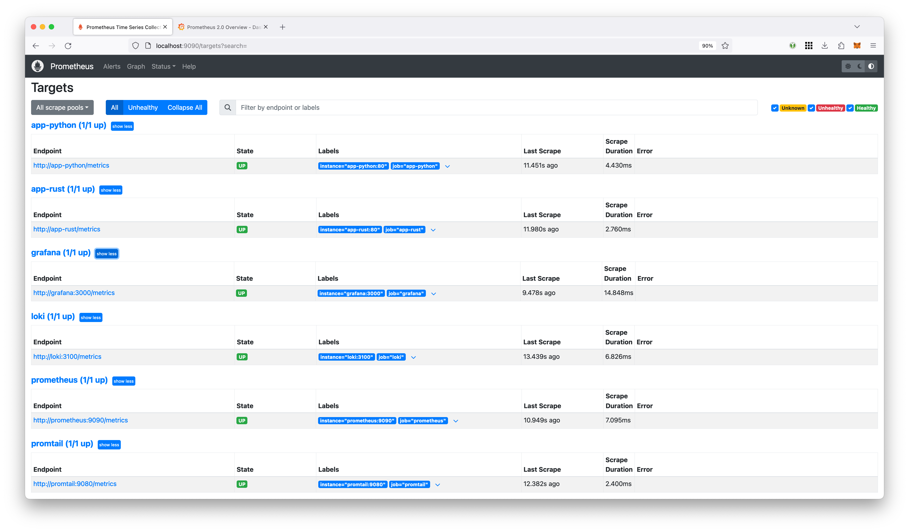

# Metrics

## Prometheus targets


## Loki Dashboard



## Prometheus Dashboard



## Enchancements on Docker Compose configuration

### Log rotation

For log rotation, the following parameters have been added to the `x-logging`
configuration:

```yml
max-size: "10m"
max-file: "3"
```

With these settings, Docker will keep up to 3 log files for each service, and
each log file will be a maximum of 10MB. When a log file reaches 10MB, Docker
will automatically rotate it and create a new one. Once there are more than 3
log files, Docker will start deleting the oldest ones.

### Memory limits

Memory limits have been set by creating a yaml-anchor and adding it to the
configuration of each service:

```yml
x-deploy:
  &default-deploy
  resources:
    limits:
      memory: 100M

...
<some-service>:
    deploy: *default-deploy
```

With this configuration, each service is limited to using a maximum of 100MB of
memory.

## Bonus: Adding metrics to my applications

### Python Application

I have integrated the `prometheus-fastapi-instrumentator` package into my
FastAPI application to expose common Prometheus metrics.

Here's a brief overview of the steps I took:

1. I added the `prometheus-fastapi-instrumentator` package to the project.
2. I added the following code to the FastAPI application:

   ```python
   Instrumentator().instrument(app).expose(app)
   ```

   This exposed a `/metrics`
   endpoint in the FastAPI application that Prometheus can scrape.

Here are some of the exposed metrics:

```text
$ curl localhost:8000/metrics |  tail
  % Total    % Received % Xferd  Average Speed   Time    Time     Time  Current
                                 Dload  Upload   Total   Spent    Left  Speed
100  7368  100  7368    0     0  3120k      0 --:--:-- --:--:-- --:--:-- 3597k
http_request_duration_seconds_bucket{handler="/metrics",le="0.1",method="GET"} 6.0
http_request_duration_seconds_bucket{handler="/metrics",le="0.5",method="GET"} 6.0
http_request_duration_seconds_bucket{handler="/metrics",le="1.0",method="GET"} 6.0
http_request_duration_seconds_bucket{handler="/metrics",le="+Inf",method="GET"} 6.0
http_request_duration_seconds_count{handler="/metrics",method="GET"} 6.0
http_request_duration_seconds_sum{handler="/metrics",method="GET"} 0.009579704143106937
# HELP http_request_duration_seconds_created Latency with only few buckets by handler. Made to be only used if aggregation by handler is important. 
# TYPE http_request_duration_seconds_created gauge
http_request_duration_seconds_created{handler="/",method="GET"} 1.7109203858405263e+09
http_request_duration_seconds_created{handler="/metrics",method="GET"} 1.710920390145804e+09
```

Metrics are available in Prometheus:



### Rust Application

I have integrated the `actix-web-prom` crate into my Actix web application to
expose common Prometheus metrics.

Here's a brief overview of the steps I took:

1. I added the `actix-web-prom` crate to the project.
2. I added the following code to the Actix web application:

   ```rust
   let prometheus = PrometheusMetrics::new("api", Some("/metrics"), None);
   App::new().wrap(prometheus.clone()).service(moscow_time)
   ```

  This exposed a `/metrics` endpoint in the Actix web application that
  Prometheus can scrape.

Here are some of the exposed metrics:

```text
$ curl localhost:80/metrics
# HELP actix_http_requests_duration_seconds HTTP request duration in seconds for all requests
# TYPE actix_http_requests_duration_seconds histogram
actix_http_requests_duration_seconds_bucket{endpoint="/metrics",method="GET",status="200",le="0.005"} 3
actix_http_requests_duration_seconds_bucket{endpoint="/metrics",method="GET",status="200",le="0.01"} 3
actix_http_requests_duration_seconds_bucket{endpoint="/metrics",method="GET",status="200",le="0.025"} 3
actix_http_requests_duration_seconds_bucket{endpoint="/metrics",method="GET",status="200",le="0.05"} 3
actix_http_requests_duration_seconds_bucket{endpoint="/metrics",method="GET",status="200",le="0.1"} 3
actix_http_requests_duration_seconds_bucket{endpoint="/metrics",method="GET",status="200",le="0.25"} 3
actix_http_requests_duration_seconds_bucket{endpoint="/metrics",method="GET",status="200",le="0.5"} 3
actix_http_requests_duration_seconds_bucket{endpoint="/metrics",method="GET",status="200",le="1"} 3
actix_http_requests_duration_seconds_bucket{endpoint="/metrics",method="GET",status="200",le="2.5"} 3
actix_http_requests_duration_seconds_bucket{endpoint="/metrics",method="GET",status="200",le="5"} 3
actix_http_requests_duration_seconds_bucket{endpoint="/metrics",method="GET",status="200",le="10"} 3
actix_http_requests_duration_seconds_bucket{endpoint="/metrics",method="GET",status="200",le="+Inf"} 3
actix_http_requests_duration_seconds_sum{endpoint="/metrics",method="GET",status="200"} 0.0009860000000000001
actix_http_requests_duration_seconds_count{endpoint="/metrics",method="GET",status="200"} 3
# HELP actix_http_requests_total Total number of HTTP requests
# TYPE actix_http_requests_total counter
actix_http_requests_total{endpoint="/metrics",method="GET",status="200"} 3
```

Metrics are available in Prometheus:


### Updated Prometheus Targets



## Bonus: Docker Healthchecks

First, I addded `/health` endpoints to both Python and Rust applications and
installed `wget` to the containers. Then, I prepended the following
configuration to each service in `docker-compose.yml` file:

```yml
healthcheck:
  test: ["CMD-SHELL", "wget --no-verbose --tries=1 --spider http://hostname/health-endpoint || exit 1"]
  interval: 10s
  timeout: 10s
  retries: 3
```

To enable healthchecks for the `promtail` container without using `curl` or
`wget`, I implemented a workaround. I found inspiration from this
[article][article] that provides an approach to send requests using just a
native Bash.

[article]:
    https://medium.com/bash-tips-and-tricks/part01-tcp-udp-request-with-a-native-bash-feature-and-without-curl-wget-9dcef59c30aa

Here are the statuses of the services:

```text
$ docker compose ps --format 'table {{.Name}}\t{{.Status}}'
NAME                      STATUS
monitoring-app-python-1   Up 7 minutes (healthy)
monitoring-app-rust-1     Up 7 minutes (healthy)
monitoring-grafana-1      Up 7 minutes (healthy)
monitoring-prometheus-1   Up 7 minutes (healthy)
monitoring-promtail-1     Up 7 minutes (healthy)
```
