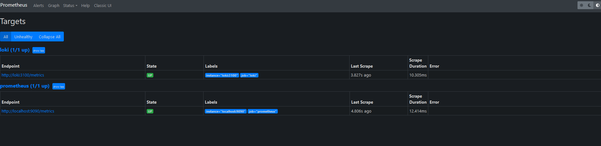
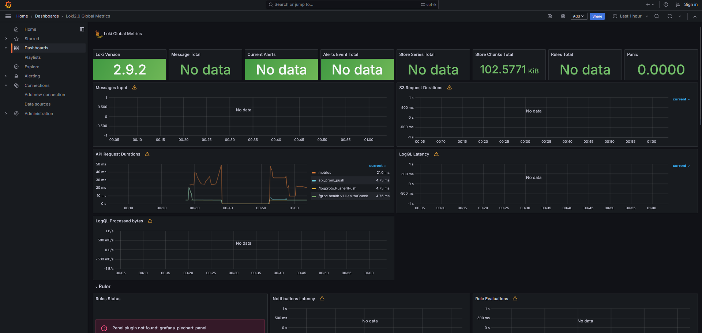
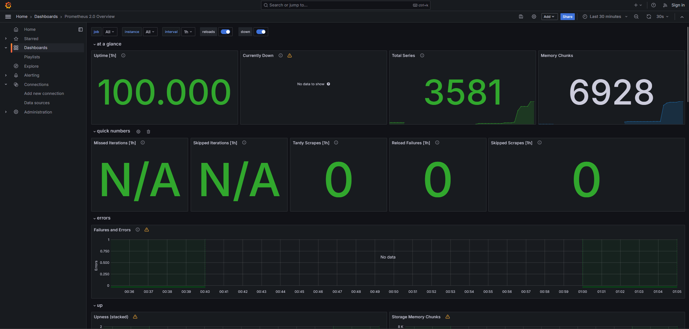
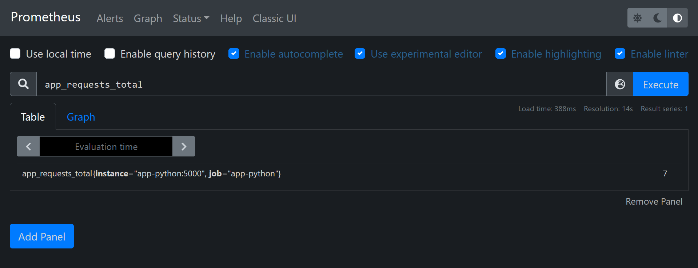

# Task 1.
## Prometheus work


# Task 2.
## Loki Dashboard


## Prometheus Dashboard


# Logging Configuration:
```yaml
x-logging:
  &default-logging
  driver: "json-file"
  options:
    max-size: "100m"
    max-file: "10"
    tag: "{{.ImageName}}|{{.Name}}"
```
- **Purpose:** Reusable logging configuration for containers.
- **Description:** 
  - `driver`: Logs stored as JSON files (`json-file`).
  - `options`: 
    - `max-size`: Rotate logs at 100MB (`100m`).
    - `max-file`: Retain up to 10 log files.
    - `tag`: Log message tag with image and container name.

# Deployment Configuration:
```yaml
x-deploy:
  &default-deploy
  resources:
    limits:
      memory: 100M
```
- **Purpose:** Reusable deployment constraints for containers.
- **Description:** 
  - `resources`: 
    - `limits`:
      - `memory`: Maximum memory allocation of 100MB.

# /metrics



- **Metrics**:
  - **`app_requests_total`**: Counter tracking the total number of requests received by the application.
    - This metric counts each time any endpoint of the application is accessed.

- **Integration**:
  - Prometheus scrapes the `/metrics` endpoint at regular intervals to collect metrics data.
  - These metrics can be visualized and analyzed using Prometheus or integrated with other monitoring systems.