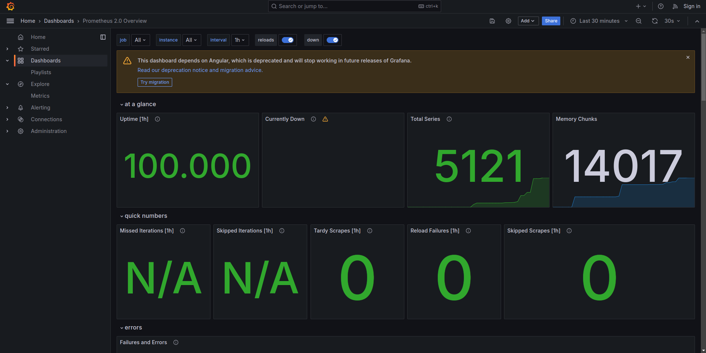
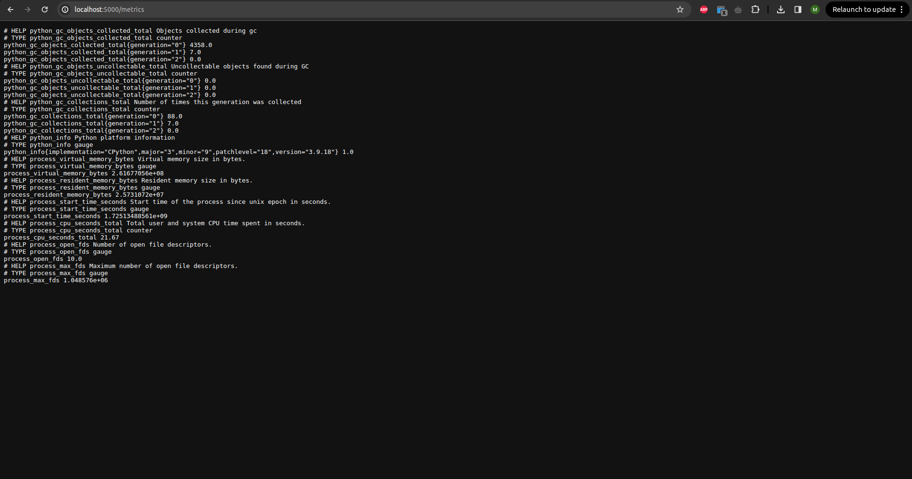
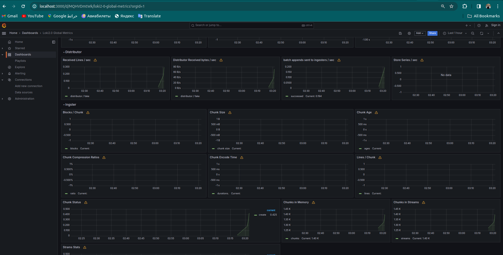
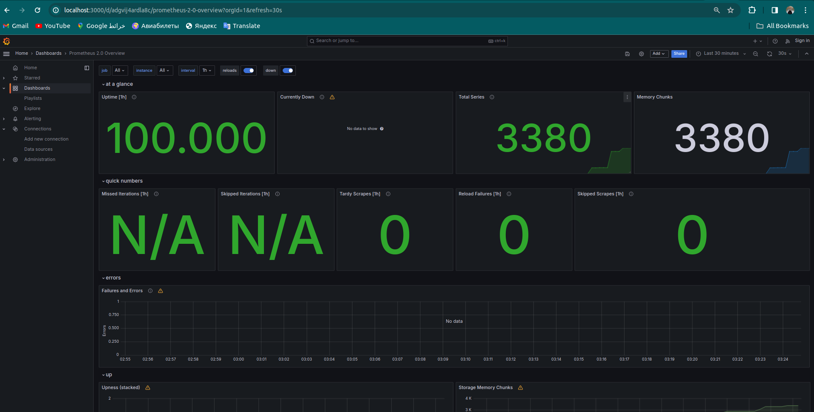
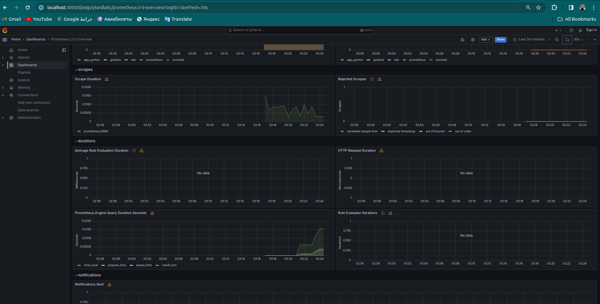
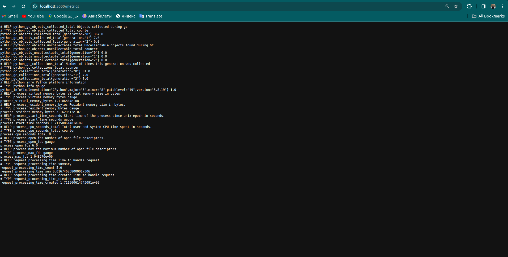

# Metrics lab

## Screenshots

- screenshot that confirm the successful setup



- Dashboards for Loki





- Dashboards for Prometheus 





- Metrics for python web app



## Service configuration updates

I added the following mechanism to docker-compose.yml

```yml
x-logging:
  &default-logging
  driver: "json-file"
  options:
    tag: "{{.ImageName}}|{{.Name}}"
    max-size: '50m'
    max-file: '5'
```

For memory  added

```yml
x-deploy:
  &default-deploy
  resources:
    limits:
      memory: 200M
```

## Healthceck

For health check I added the following script

```yml
healthcheck:
    test: [ "CMD-SHELL", "curl --fail http://localhost:{port}/ || exit 1" ]
    interval: 1m
    timeout: 15s
    retries: 3
    start_period: 15s
```
