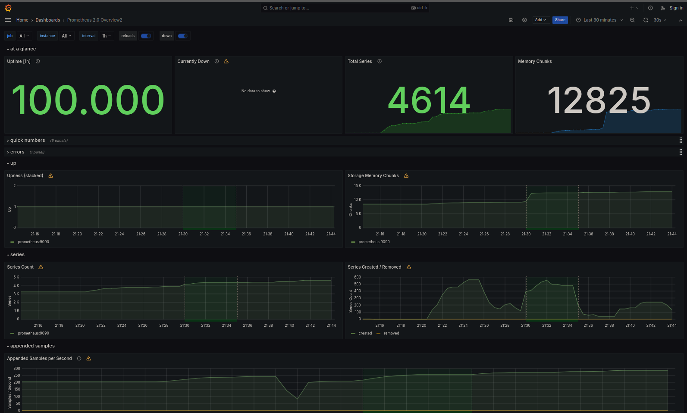
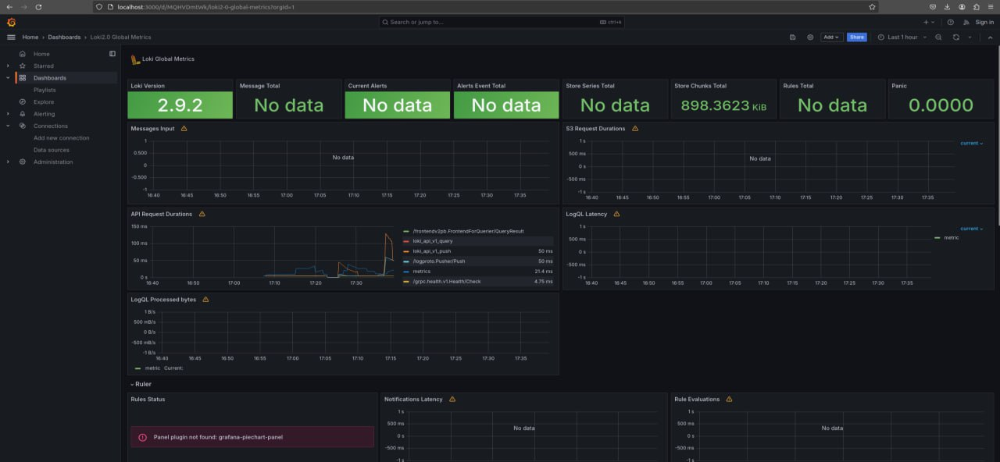
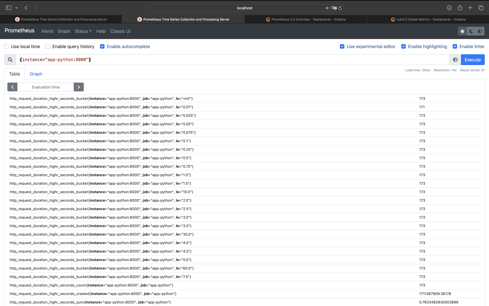
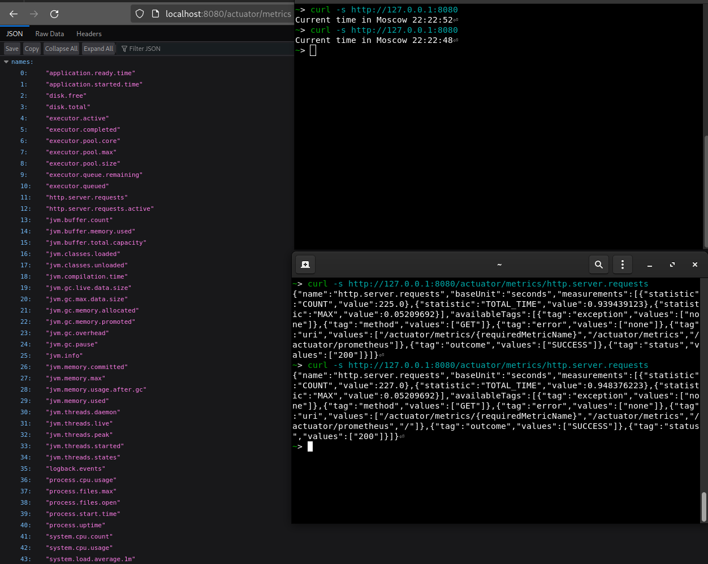

# Metrics

## Task 1

### Targets


## Task 2

### Dashboard prometheus



### Dashboard loki



### Log rotation

I already had limits on log size and number in my `docker-compose.yml`

```yml
max-size: 20M
max-file: 10
```

### Memory limitation

For every container in `docker-compose.yml` I added similar lines:

```yml
deploy:
  resources:
    limits:
      memory: 90M
```

## Bonus task

### app_python

I added some metrics with [`prometheus-flask`](https://pypi.org/project/prometheus-flask-exporter/)

* flask_http_request_duration_seconds (Histogram) Labels: method, path and status. Flask HTTP request duration in seconds for all Flask requests.
* flask_http_request_total (Counter) Labels: method and status. Total number of HTTP requests for all Flask requests.
* flask_http_request_exceptions_total (Counter) Labels: method and status. Total number of uncaught exceptions when serving Flask requests.
* flask_exporter_info (Gauge) Information about the Prometheus Flask exporter itself (e.g. version).



### app_kotlin

I added some metrics with [`spring-boot-starter-actuator`](https://mvnrepository.com/artifact/org.springframework.boot/spring-boot-starter-actuator)

* "application.ready.time"
* "application.started.time"
* "disk.free","disk.total"
* "executor.active"
* "executor.completed"
* "executor.pool.core"
* "executor.pool.max"
* "executor.pool.size"
* "executor.queue.remaining"
* "executor.queued"
* "http.server.requests"
* ...


