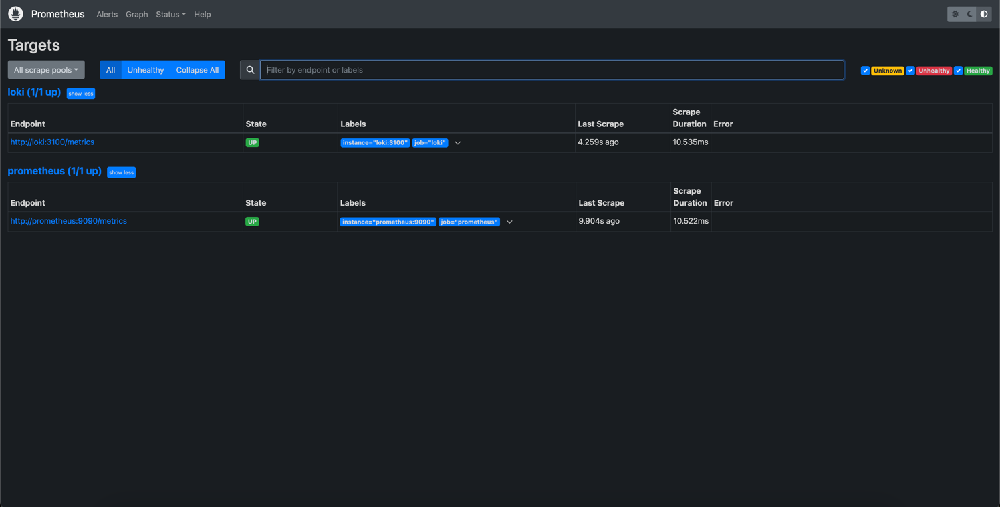
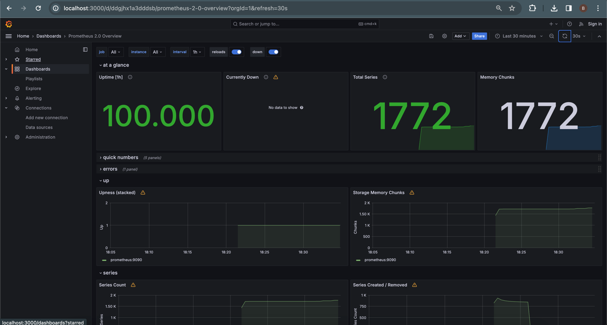
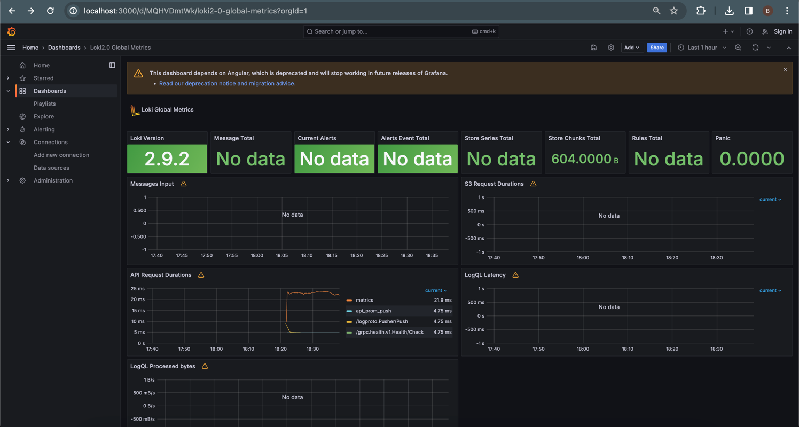
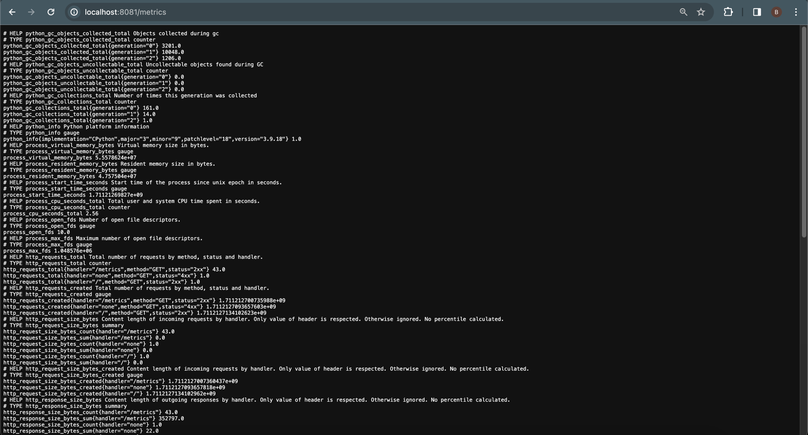
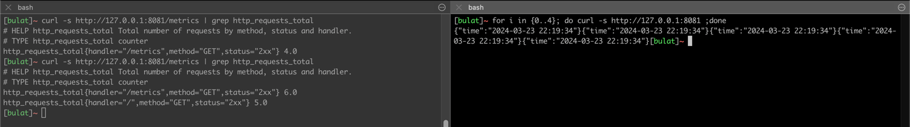
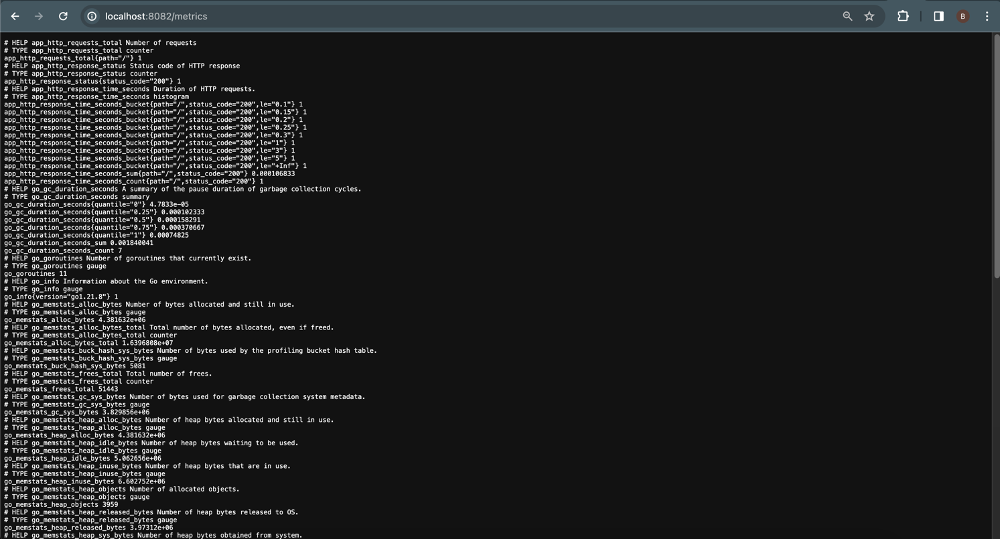
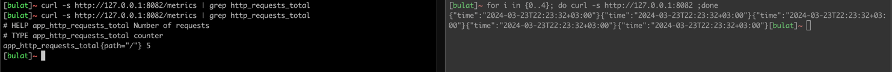

## Targets (loki and prometheus)



## Dashboard (prometheus)



## Dashboard (loki)


### Log rotation
Added to logging 
```
    max-size: 15M
    max-file: 5
```
where ```max-size``` tells Docker to limit the size of Docker log file.

and ```max-file``` instructs Docker to store no more than 5 log files.

### Memory limits
Per each container I added specific memory limits configuration
```
    deploy:
      resources:
        limits:
          memory: 90M
```
Like this.

## Bonus task

### app_python
Added several metrics using ```prometheus_fastapi_instrumentator```
```
Counter http_requests_total labels=[handler, status,method].
Summary http_request_size_bytes labels=[handler]. 
Summary http_response_size_bytes labels=[handler].
Histogram http_request_duration_seconds labels=[handler,method. 
Histogram http_request_duration_highr_seconds labels=[].
```
And other python specific (about python GC)




### app_go
Added several metrics into app
```
Counter http_requests_total labels=[path].
Histogram http_response_time_seconds labels=[path,status_code]. 
Counter http_response_status labels=[status_code].
```
Also there are other metrics (GC, heap alloc and etc)



