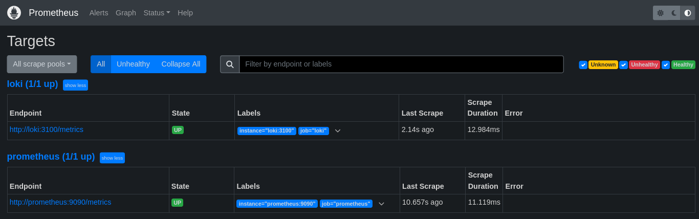
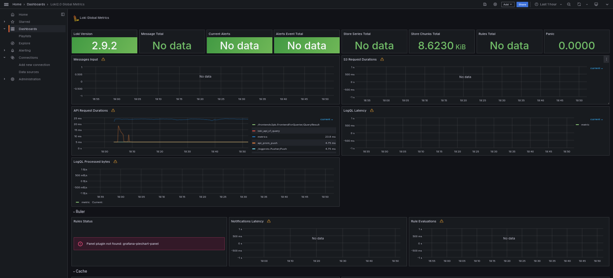
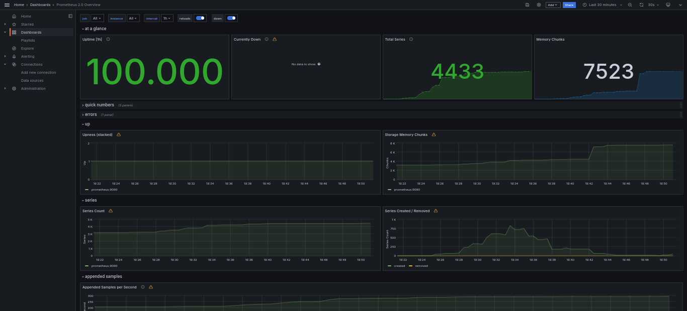

# Lab8 Task1



# Lab8 Task2

Changes in ```app_python/app.py```:
```python
from prometheus_client import generate_latest
import pytz

app = Flask(__name__)

@app.route('/metrics')
def metrics():
    return Response(generate_latest(), content_type='text/plain')
```

## Log rotation:

Added in ```default-logging``` max-size and max-file parameters:
```yaml
  options:
    tag: "{{.ImageName}}|{{.Name}}"
    max-size: 10M   #size of Docker log files
    max-file: 10    #max number of Docker log files
```

## Memory limits:

Added memory limits in ```100MB``` for containers:
```yaml
    #memory limit
    deploy:
      resources:
        limits:
          memory: 100M
```

## Loki dashboard



## Prometheus dashboard

