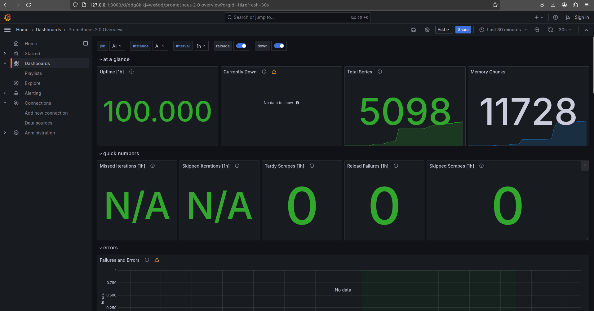
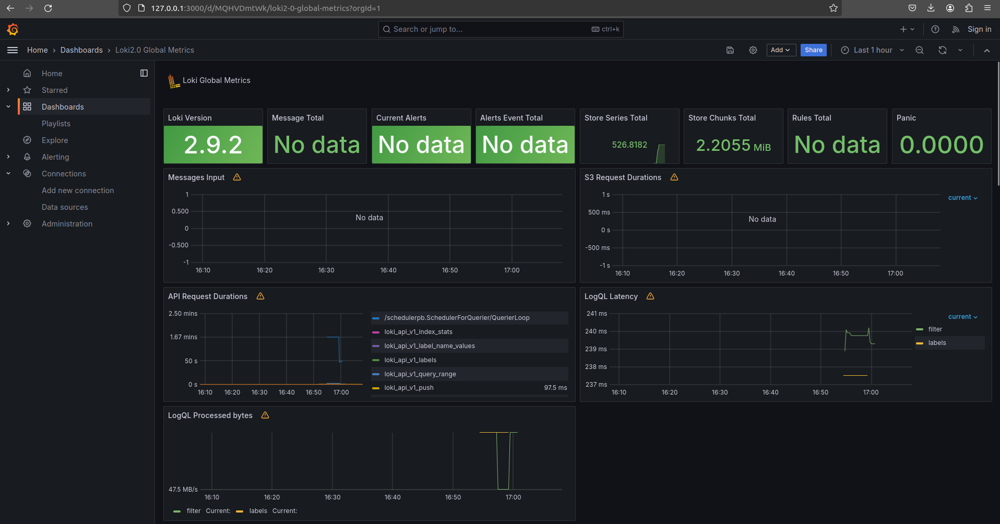
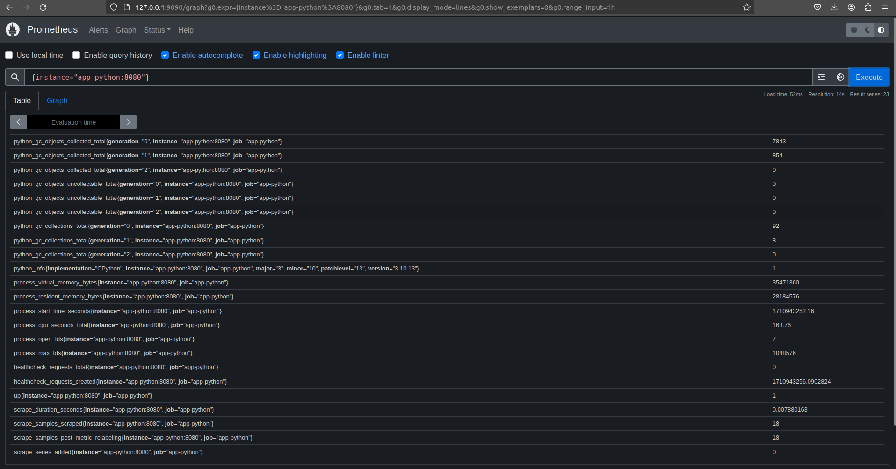

# Metrics
## Targets in Prometheus 


## Prometheus Grafana Dashboard


## Loki Grafana Dashboard


## Loging rotation
I enhanced `x-logging` as following:
```commandline
x-logging:
  &default-logging
  driver: "json-file"
  options:
    max-size: "10m"
    max-file: "5"
    tag: "{{.ImageName}}|{{.Name}}"
```
where `max-size: "10m"` limits log file size up to 10Mb and `max-file: "5"` limits the number of log files up to 5. 
As one file reaches limit, Docker creates another file, as the number of files reaches the limit, Docker removes old ones
and creates new instead of old.

## Memory limits
I enhanced `docker-compose.yml` by adding `x-deploy` as following:
```commandline
x-deploy:
  &default-deploy
  resources:
    limits:
      memory: 200M
```
This part of settings limits services to use at maximum 200Mb.

## Metrics in Python App
I integrated metrics into my app by adding the following snippet to `app.py`:
```commandline
from prometheus_client import generate_latest, Counter

@app.route('/metrics')
def metrics():
    return Response(generate_latest(), content_type='text/plain')
```
This adds `/metrics` endpoint for Prometheus data colletion.
Here is the example of metrics in Prometheus:


## Healthchecks
For the healthchecks I added two more snippets:
* this snippet to the `docker-compose.yml`:
```commandline
    healthcheck:
      test: [ "CMD-SHELL", "wget --no-verbose --tries=1 --spider http://localhost:9090/status || exit 1" ]
      interval: 10s
      timeout: 15s
      start_period: 15s
      retries: 3
```
* this snippet to the `app.py`:
```commandline
healthcheck_counter = Counter(
    'healthcheck_requests',
    'Number of healthcheck requests'
)
# ...
@app.route('/healthcheck')
def healthcheck():
    healthcheck_counter.inc()
    return 'Ok'
```
