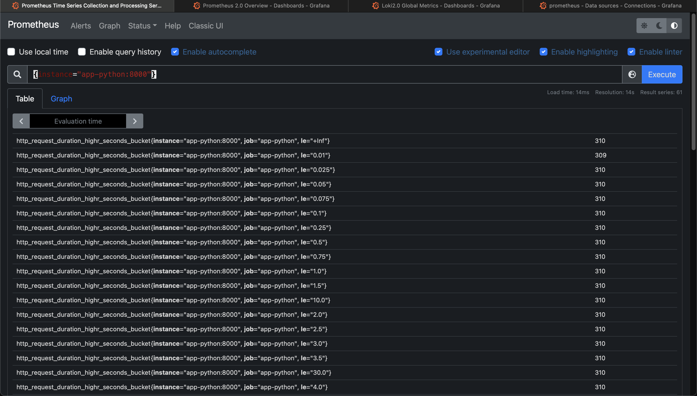
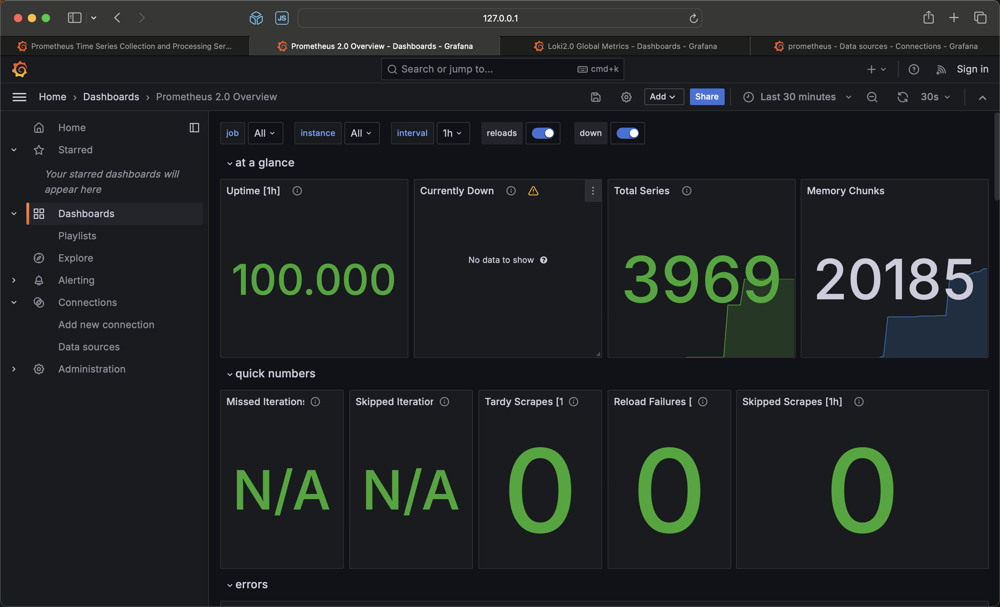
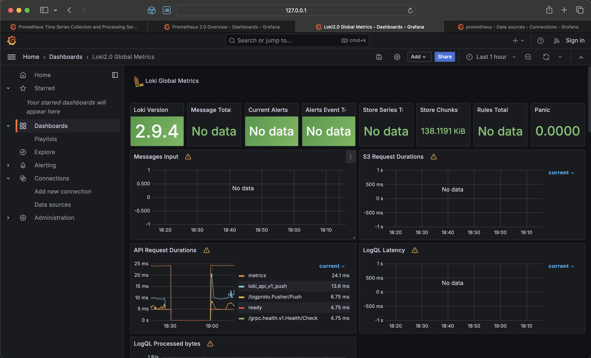
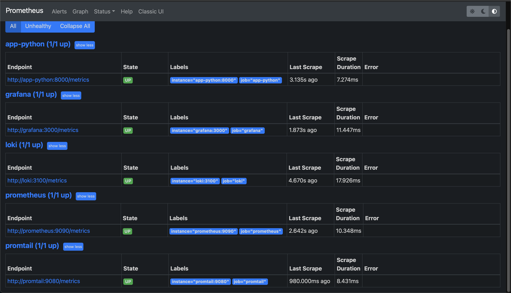

# Metrics

## Log rotation

```yml
max-size: "20m"
max-file: "5"
```

## Memory limits

```yml
limits:
  memory: 200M
```

## healthcheck

```yml
healthcheck:
  test: [ "CMD", "curl", "-f", "http://localhost:8000" ]
  interval: 30s
  timeout: 15s
  retries: 3
```

## Screenshoots

### Prometheus targets

### Enchancements on Docker Compose configuration

### Loki Dashboard

### Prometheus Dashboard


