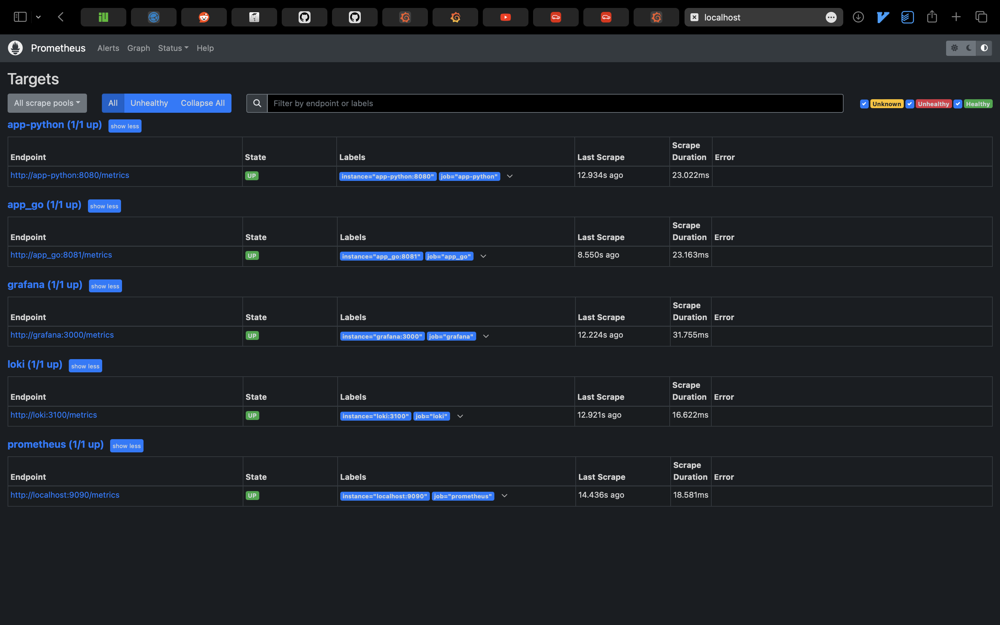
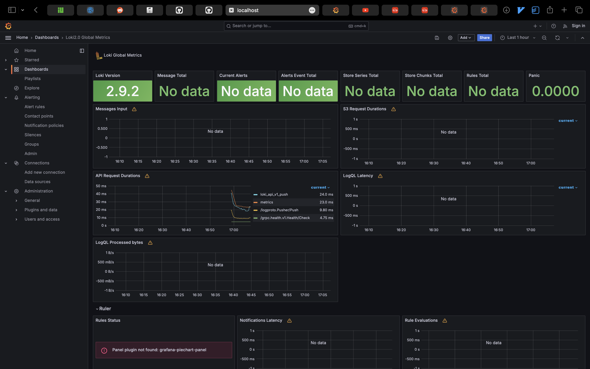
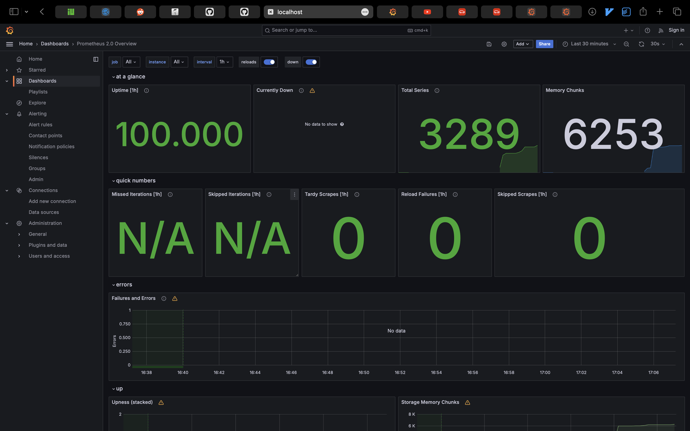
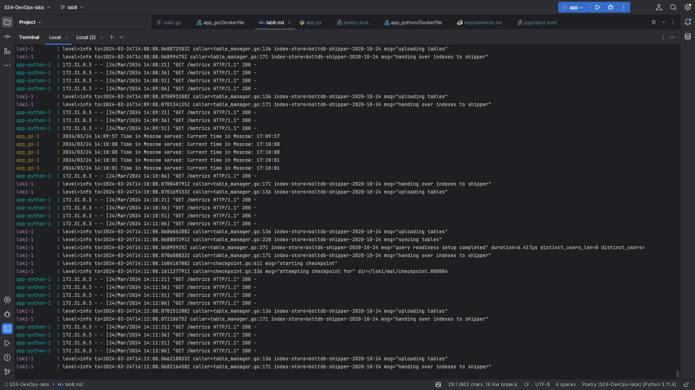
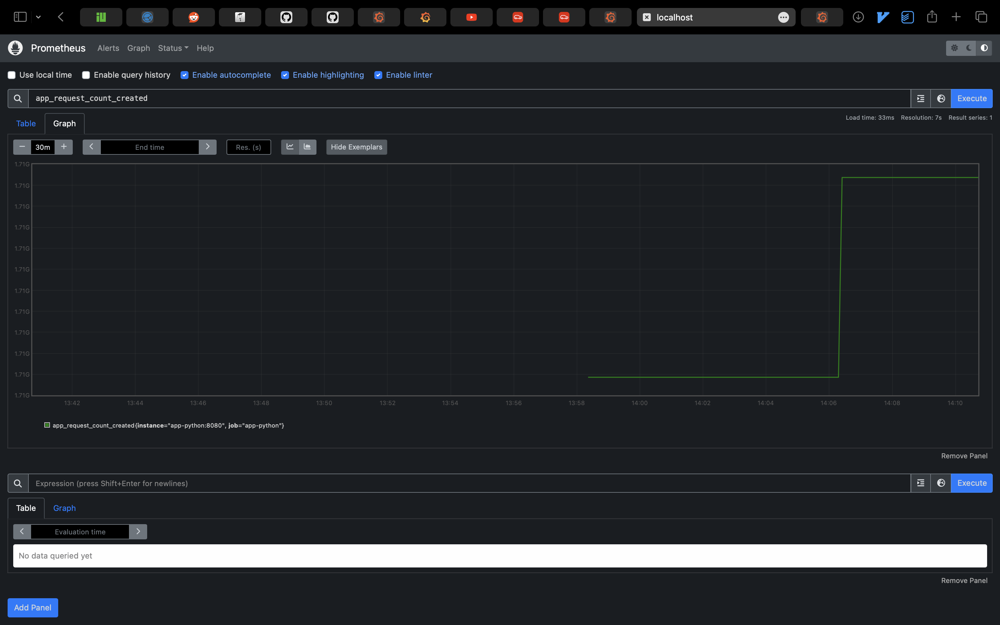

# Task 1

------
# Task 2

## Configurations

The `docker-compose.yml` is configured with service definitions for our applications (`app-python` & `app_go`), monitoring stack (`loki`, `promtail`, `prometheus`, & `grafana`), as well as network and logging configurations.

**Networks:**
Two separate Docker networks, `loki` and `prometheus`, are defined to logically segregate our logging and monitoring services. Services communicate within these networks as required.

**Logging:**
The `x-logging` anchor defines common logging configurations using the `json-file` driver. Log files are capped at 10MB, and the Docker image and container names are included in the log tags for easy identification.

**Deploy:**
Resource limits are set using the `x-deploy` anchor to avoid any single container consuming excessive system memory. In this case, we've set a 500MB memory limit for each service.

**Health Checks:**
Each application service (`app-python` & `app_go`) includes a health check using `curl` to ensure that the service is responsive. If a service becomes unresponsive, Docker will restart the container based on these checks.

**Metrics:**
1. `app-python` & `app_go` services expose their metrics at their respective ports (8080 & 8081). 
2. `prometheus` is set up to scrape these metrics endpoints, along with its own metrics.
   
**Service-Specific Information:**

### app-python:

- Uses the official `rmoll/moscow_time_web_app:latest` image.
- Service is allocated 500MB of memory and logs capped at 10MB.
- Uses the `prometheus` network for metrics exporting.
- Exposes port 8080 for both the Flask application and Prometheus scraping.

### app_go:

- Uses `rmoll/moscow_time_web_app_go:latest` Docker image.
- Log files are stored in a volume mapped to `./logs`.
- Service is assigned 500MB of memory.
- Logging and network configurations follow the previously mentioned defaults.

### loki & promtail:

- Loki is deployed using `grafana/loki:2.9.2` with commands specified for configuration.
- Promtail uses `grafana/promtail:2.9.2`, mapping in a custom configuration via volume.
- Both services share networks with Prometheus to facilitate logs collection and querying.

### prometheus:

- Prometheus service uses the `prom/prometheus:v2.51.0` Docker image.
- A configuration file is passed into the container, which includes the scrape targets for our application.
- Ports are exposed for accessing the Prometheus web UI and scraping.

### grafana:

- Environments and volumes are set up to support Grafana's configurations, including data source provisioning for Prometheus and Loki.
- The official `grafana/grafana:latest` image is used.
- Ports are exposed for web access.
- Uses both `prometheus` and `loki` networks.

------

# Task 3

------
# Python
## Integrated Metrics

In our Python Flask application, we have integrated Prometheus metrics to gather insights into our application's performance and provide real-time monitoring capability.

### Web App Request Count (app_request_count)

Metric Type: Counter

Description:
This metric records the total number of requests made to the web application. 

Why We Collect It:
We collect this metric to monitor the traffic levels our app handles. It helps measure the app's utilization and observe trends or spikes in usage, which is valuable for capacity planning and understanding user engagement.

### Moscow Time as a Gauge (moscow_time_seconds)

Metric Type: Gauge

Description:
This gauge shows the current time in Moscow expressed in the total number of seconds past midnight.

Why We Collect It:
Using this metric, we can track if our application is accurately keeping up with the Moscow time-zone changes. Moreover, gauges are suitable for values that can arbitrarily go up and down, like our clock.

# Golang
## Integrated Metrics

For our Go application, we've integrated Prometheus metrics to gain insights into the application's performance and health.

### Request Count (app_get_time_requests_total)

Metric Type: Counter

Description:
This metric counts the total number of times the time retrieval endpoint (/) is hit. It provides a counter for HTTP 200 (successful response) and 500 (internal server error) status codes. We use these metrics to monitor the traffic hitting our service and to alert on any increase in error rates.

Why We Collect It:
Tracking the count of requests and differentiating them by status code allows us to monitor the health and usage of our web service over time. An increase in the 500 status code count may indicate issues that require attention. This simple yet effective metric can alert us to errors and help us ensure our application provides a reliable service.

