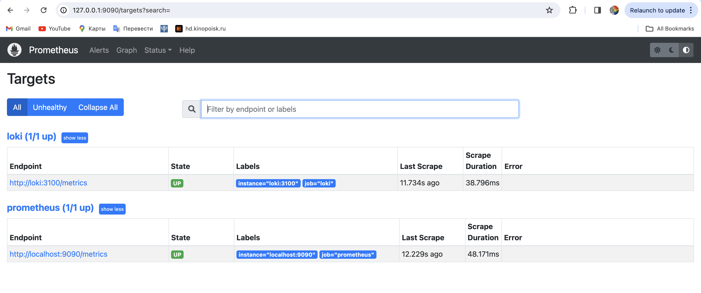
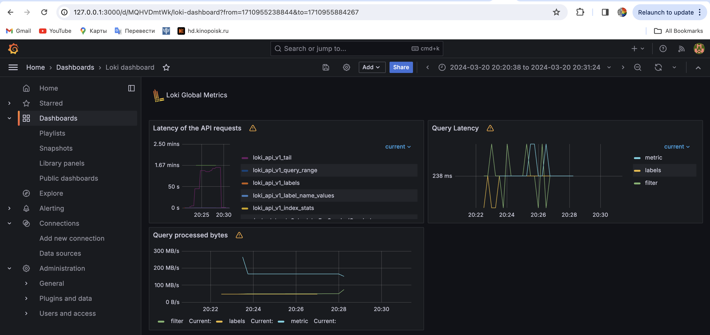
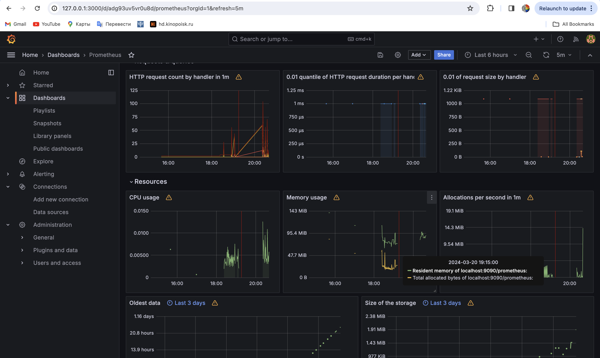
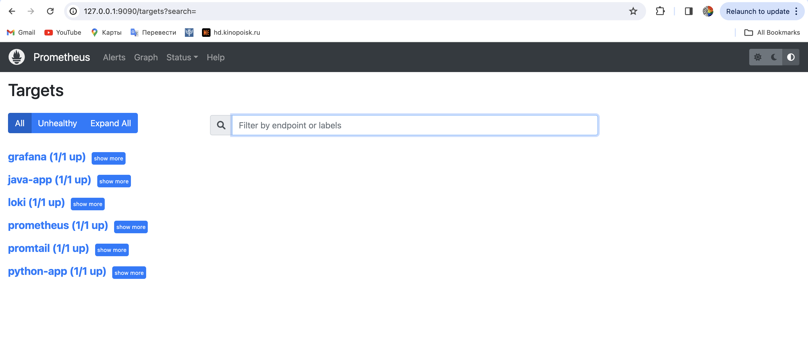
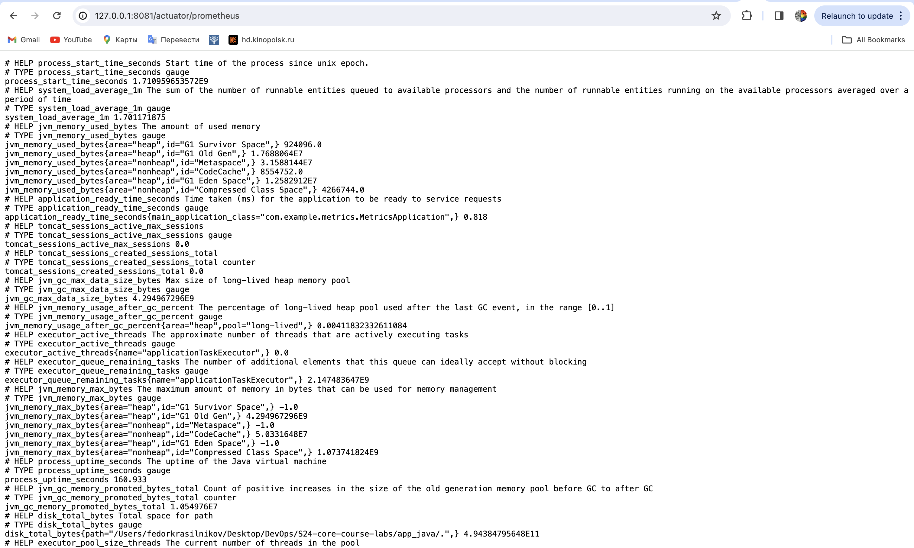
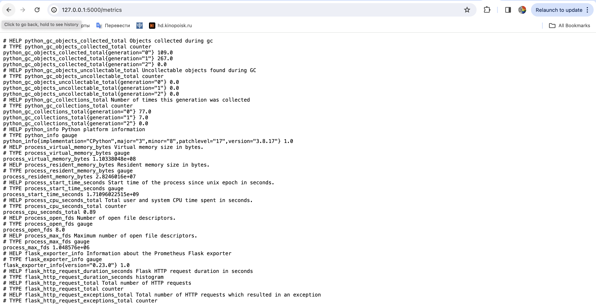
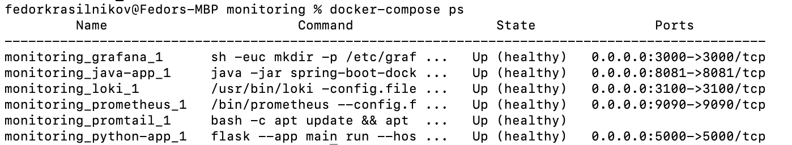

# Pics 

Targets of the prometheus:


Dashboard for loki 



Dashboard for prometheus 


## Updates to docker-compose 
* to limit the memory resources available for each container I appended the following to the services description (for the java limits were extended to 200M due to its memory consumption): 
  ```
  deploy:
      resources:
        limits:
          memory: 50M
        reservations:
          memory: 20M
  ```
* and for the logs rotation: 
  ```
  logging:
      driver: "json-file"
      options: 
        max-size: "200k"
  ```

## Bonus task 
Here are the targets after I configured collection (and export) from all the containers including java-app and python-app 


Java app metrics: 


Python app metrics 


Healthchecks: 
