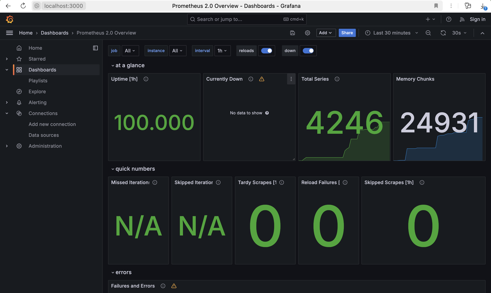
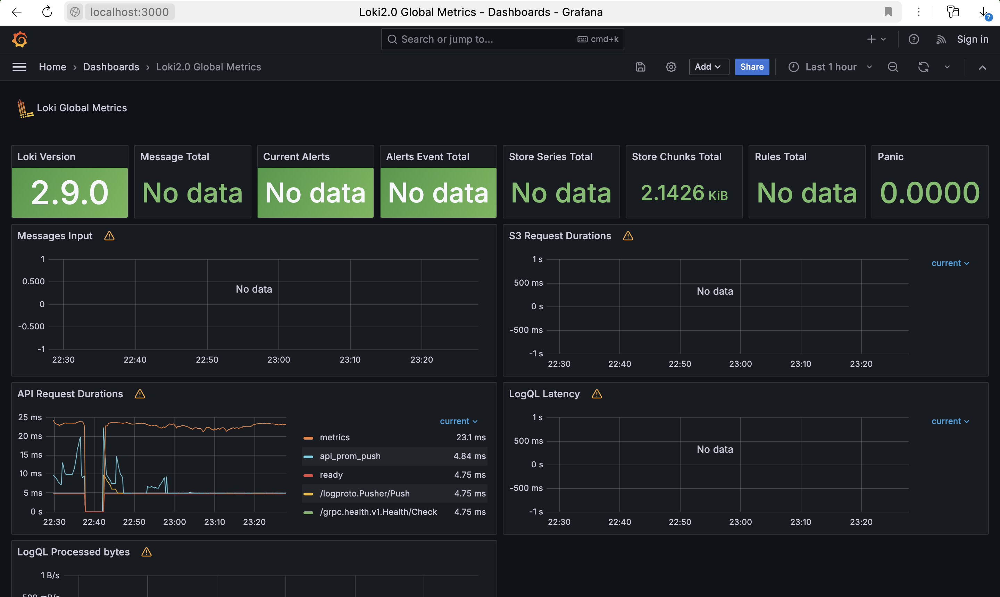
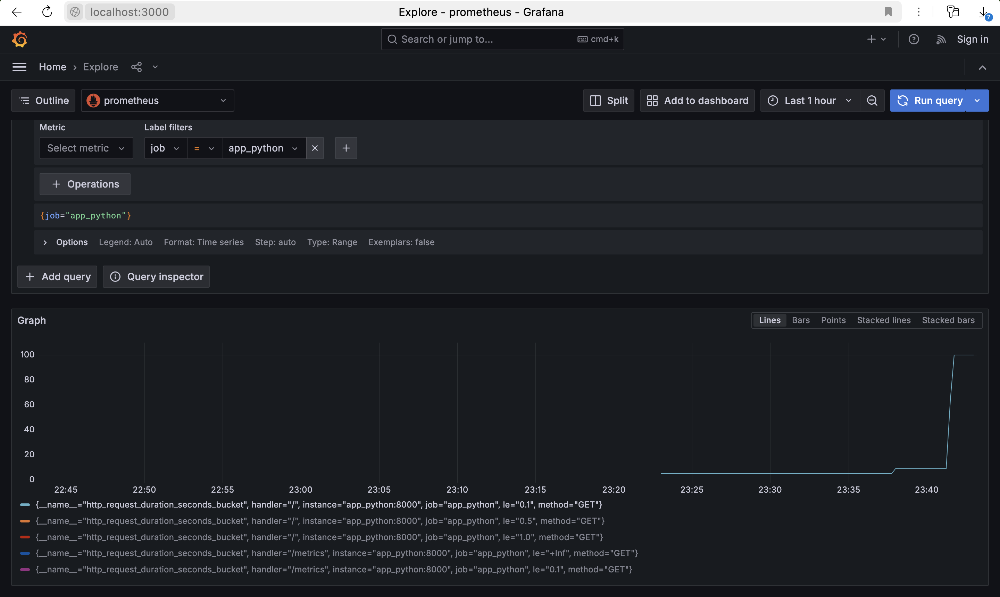

## Prometheus setup


all docker containers have been configured successfully - Prometheus is correctly scraping metrics


## Dashboard for Prometheus



## Dashboard for Loki




### Docker Compose setup

- for log rotation I have added `max-size`/`max-file`
```yaml
x-logging:
  &default-logging
  driver: "json-file"
  options:
    tag: '{{.ImageName}}|{{.Name}}|{{.ImageFullID}}|{{.FullID}}'
    max-size: '50m'
    max-file: '3'
```

- for memory_limits I have describe `x-deploy`
```yaml
x-deploy:
  &default-deploy
  resources:
    limits:
      memory: 200M
```

## Applications metrics

- Rust app

    [Used tool](https://github.com/nlopes/actix-web-prom)
    

- Python app
    
    [Used tool](https://github.com/trallnag/prometheus-fastapi-instrumentator)
    

### Healthcheck

In `docker-compose.yml` file for `app_` I have added, where `/health` is a special service health endpoint
```yaml
      test: [ "CMD-SHELL", "curl --fail http://localhost:8000/health || exit 1" ]
``` 

```
adari_ka@MacBookPro monitorig % docker-compose ps
      Name                    Command                   State                Ports         
-------------------------------------------------------------------------------------------
app_python         bash start.sh                    Up (healthy)   0.0.0.0:8000->8000/tcp
app_rust           ./app                            Up (healthy)   0.0.0.0:8001->8000/tcp
grafana            sh -euc mkdir -p /etc/graf ...   Up (healthy)     0.0.0.0:3000->3000/tcp
monitorig_loki_1   /usr/bin/loki -config.file ...   Up (healthy)     0.0.0.0:3100->3100/tcp
prometheus         /bin/prometheus --config.f ...   Up (healthy)     0.0.0.0:9090->9090/tcp
promtail           /usr/bin/promtail -config. ...   Up (unhealthy)    
```