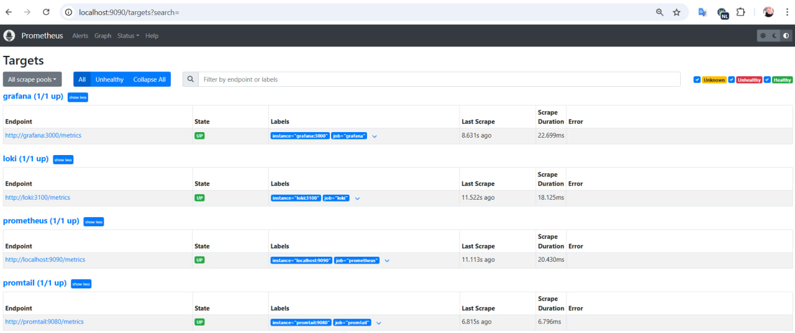

# Metrics Monitoring with Prometheus

## Prometheus Targets Verification

Prometheus has been configured to monitor the following services:
- **Prometheus**
- **Loki**
- **Grafana**
- **Promtail**

### Prometheus Targets

Below are screenshots verifying the successful setup of Prometheus scraping metrics from all the services:

The screenshot above shows that all configured targets (`prometheus`, `loki`, `grafana`, `promtail`) are successfully scraped by Prometheus, confirming that the metrics collection is working as expected.
