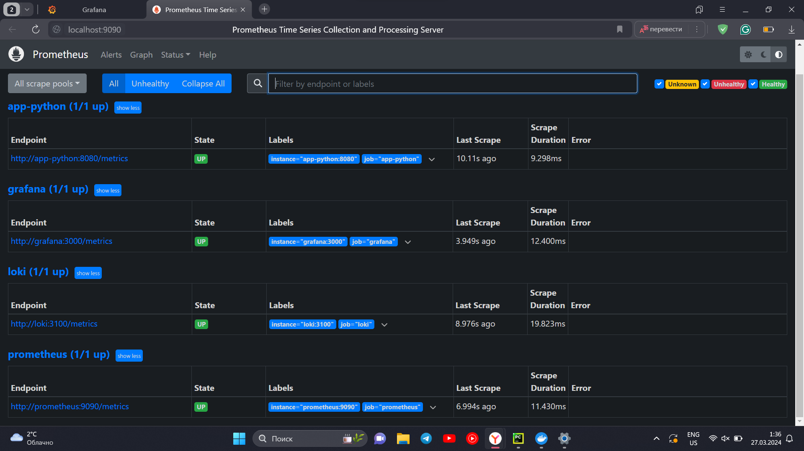
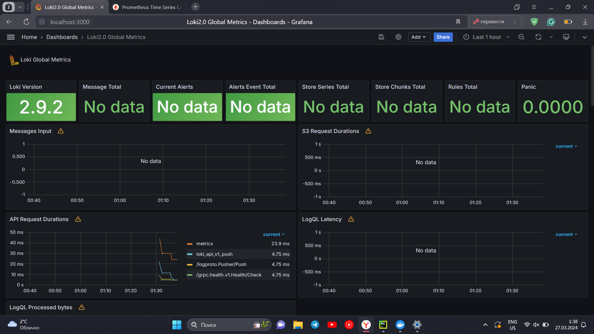
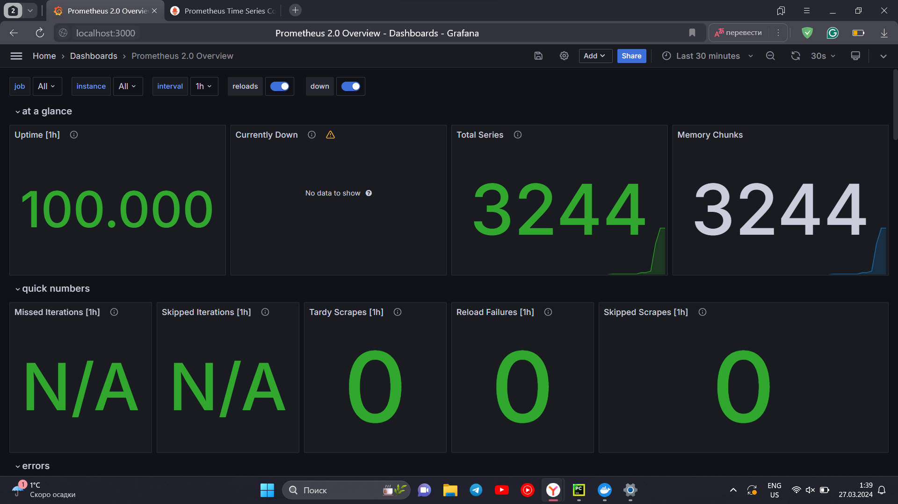

# Monitoring with Prometheus

## Prometheus Targets



## Loki Global Metrics Dashboard



## Prometheus Overview Dashboard



## Log rotation and memory limits

The memory limits are specified for each container as follows:

```yaml
x-deploy:
  &default-deploy
  resources:
    limits:
      memory: 100m  <-- here
```

Log rotation is specified by max log file size:

```yaml
x-logging:
  &default-logging
  driver: "json-file"
  options:
    tag: "{{.ImageName}}|{{.Name}}"
    max-size: "10m"  <-- here
```