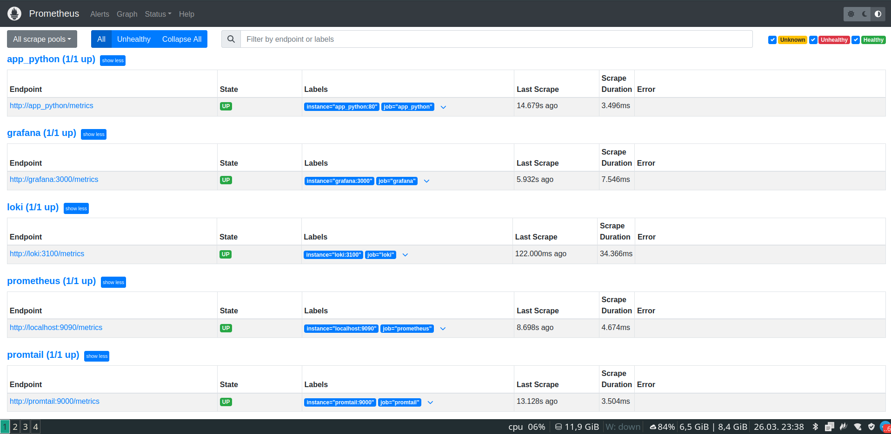
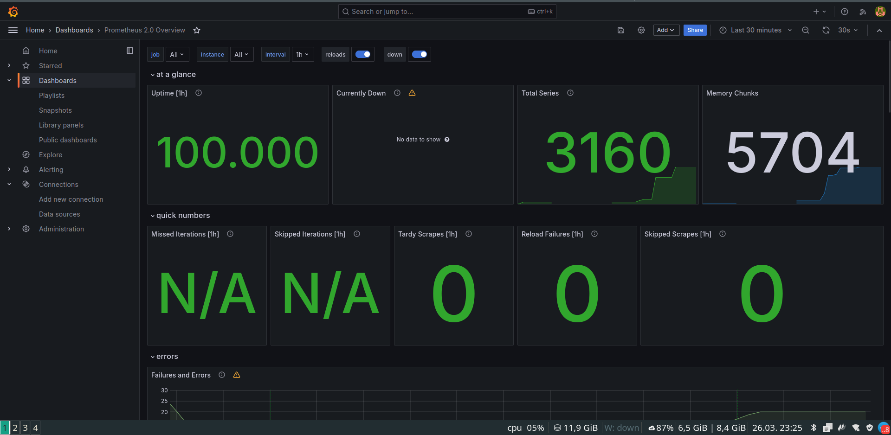
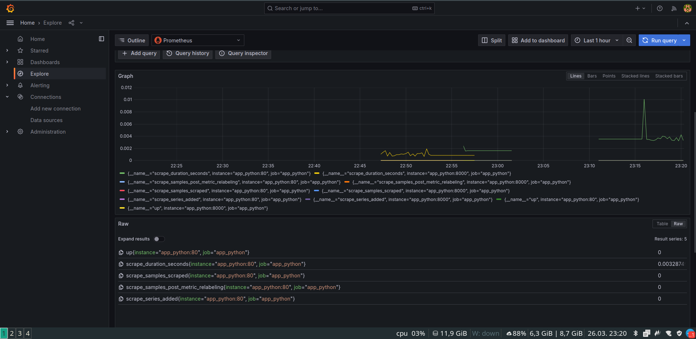

# Metrics Overview

## Task 1: Setting Up Prometheus

Updates have been made to the Python application to facilitate metric exportation. Additionally, modifications have been applied to the `docker-compose.yml` configuration file. Prometheus has been integrated along with its data source in Grafana.

Upon accessing [http://localhost:9090/targets](http://localhost:9090/targets), the following information is displayed:

## Task 2: Dashboard and Configuration Improvements

1. Grafana Dashboards

2. Services Configuration:

   - Resource Limits:
     - `python_app`: 1.0 CPU, 256MB memory
     - `loki`: 0.5 CPU, 256MB memory
     - `promtail`: 0.5 CPU, 256MB memory
     - `prometheus`: 1.0 CPU, 1GB memory
     - `grafana`: 0.5 CPU, 1GB memory

