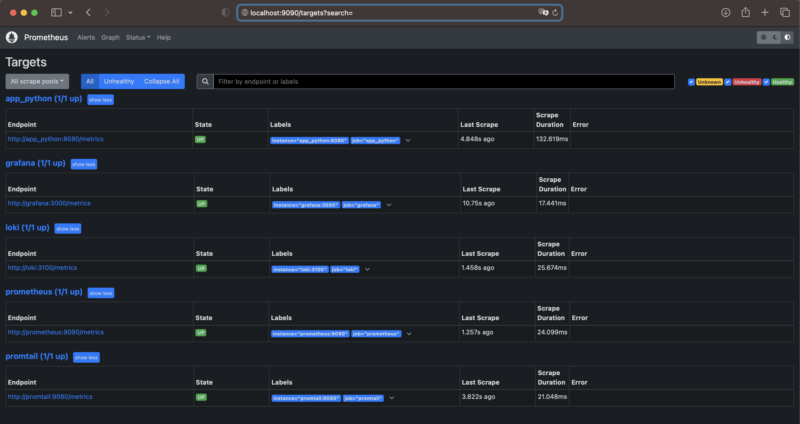
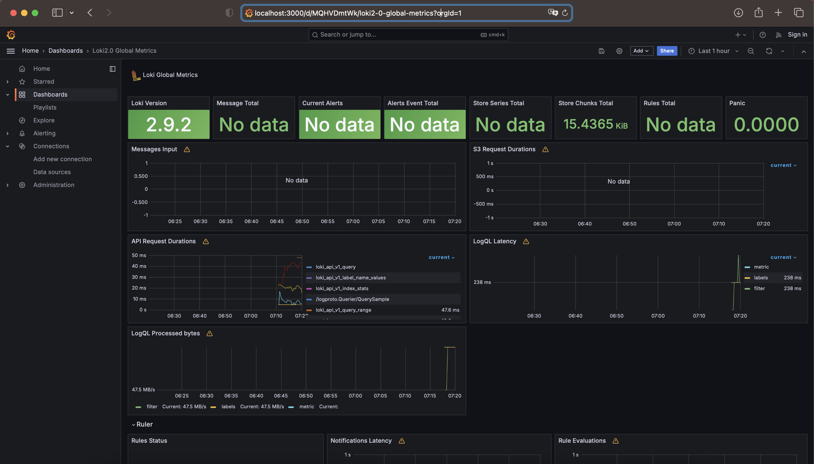
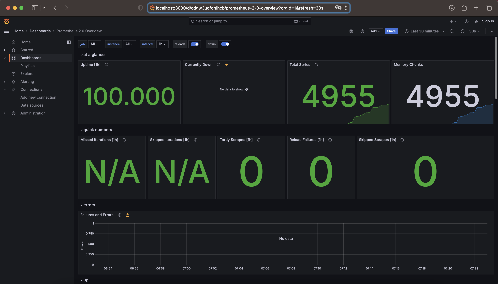

## Prometheus Setup
```
http://localhost:9090/targets
```


## Grafana Dashboards

Dashboard for Loki



Dashboard for Prometheus



## Service Configuration Updates

In the docker-compose.yml file, I implemented mechanisms for log rotation and memory limits for all services.

The memory limit for each container is set to 200MB, and log rotation is configured to maintain up to 10 files, each with a maximum size of 15MB.