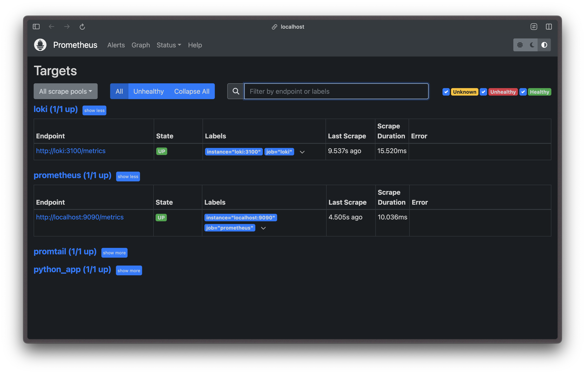
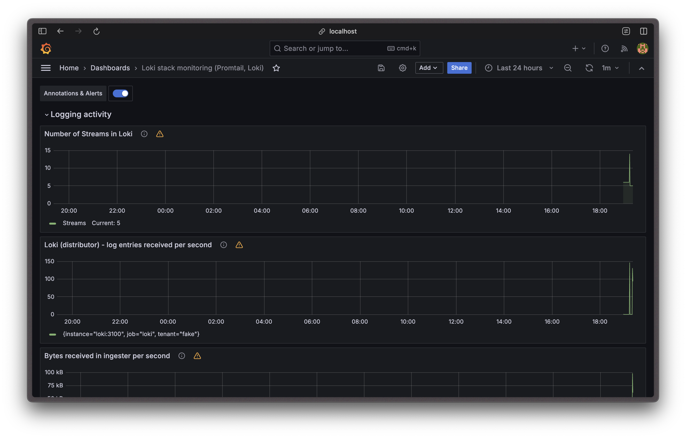
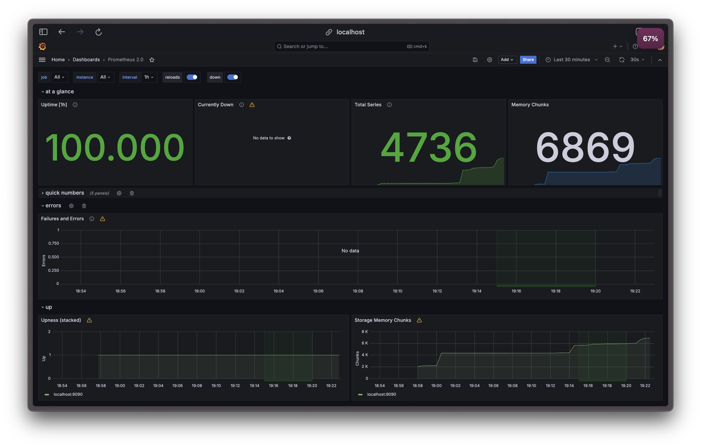

# Metrics

## Task 1 — Prometheus Setup

I've update Python app to export metrics, update `docker-compose.yml` config,
add Prometheus and its datasource to Grafana.

Accessing [http://localhost:9090/targets](http://localhost:9090/targets) shows:

## Task 2 — Dashboard and Configuration Enhancements

1. Grafana dashboards

   

   

2. Services configuration:
   - All services are configured to save logs in JSON format with a maximum size of 10MB
     and rotation of 2 files.
   - Services have the following resources limits:
     - `python_app`: 1.0 CPU, 256MB memory
     - `loki`: 0.5 CPU, 256MB memory
     - `promtail`: 0.5 CPU, 256MB memory
     - `prometheus`: 1.0 CPU, 1GB memory
     - `grafana`: 0.5 CPU, 1GB memory
