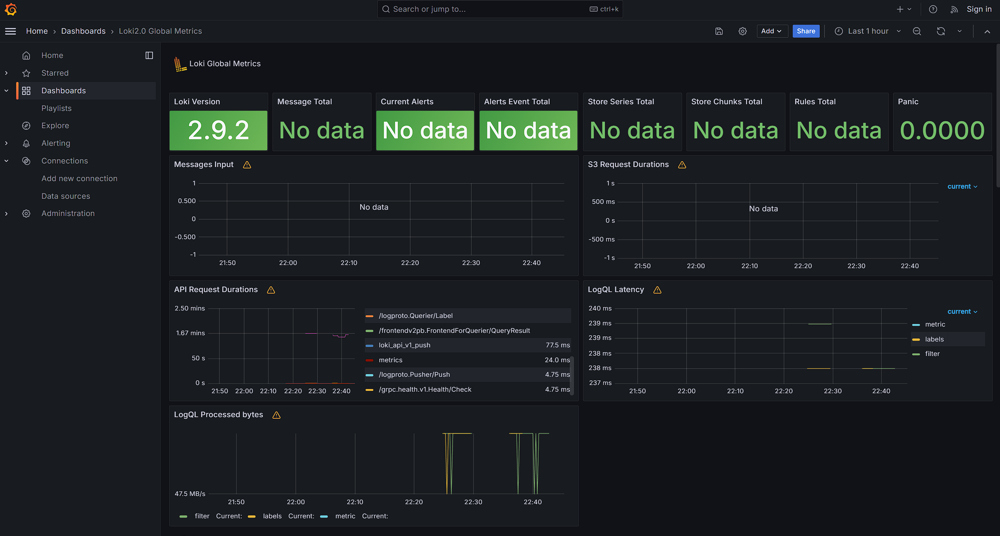
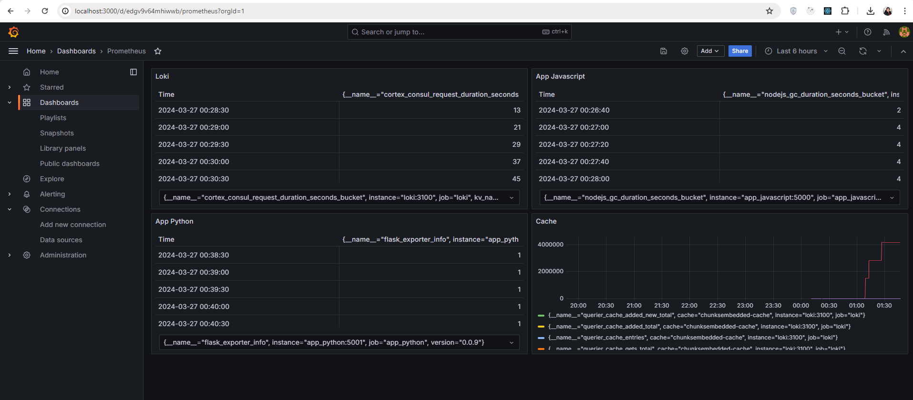

# Monitoring and Logging Configuration Guide

This document outlines the setup and configuration of our monitoring and logging stack, which includes Prometheus for metrics collection, Loki for logs aggregation, and Grafana for visualization and dashboarding.

## Docker Compose Configuration

Our services are defined within a `docker-compose.yml` file, ensuring a structured and easily manageable deployment. Key features include:

- **Log Rotation:** To manage disk usage effectively, we've implemented log rotation for all services using Docker's `json-file` logging driver. Logs will rotate when they reach 10 megabytes, with a maximum of 3 log files retained.

- **Resource Limits:** Each service is configured with a memory limit of 1000M to ensure efficient resource use and prevent any single service from consuming excessive system resources.

### Services Overview

- **App-Python:** A Python-based application serving the Moscow time.
- **Loki:** Responsible for aggregating logs from all services.
- **Promtail:** Collects logs and forwards them to Loki.
- **Prometheus:** Scrapes and stores metrics from configured targets.
- **Grafana:** Visualizes metrics and logs with customizable dashboards.

## Grafana Dashboards

Grafana is set up with dashboards for monitoring logs and metrics. To access these dashboards, navigate to `http://localhost:3000`.

### Setting Up Dashboards

1. **Loki Dashboard**: Import the [Example Dashboard for Loki](https://grafana.com/grafana/dashboards/13407) to visualize log data.
2. **Prometheus Dashboard**: Import the [Example Dashboard for Prometheus](https://grafana.com/grafana/dashboards/3662) for metrics visualization.

### Dashboard Screenshots

Below are screenshots demonstrating the configured dashboards within Grafana:

- **Prometheus Metrics Overview**
  

- **Loki Logs Dashboard**
  

- **Prometheus Dashboard**
  

## Conclusion

This setup provides a comprehensive overview of our application's health, performance, and logs. It's crucial for maintaining operational efficiency and ensuring quick diagnostics and resolutions to any arising issues.
